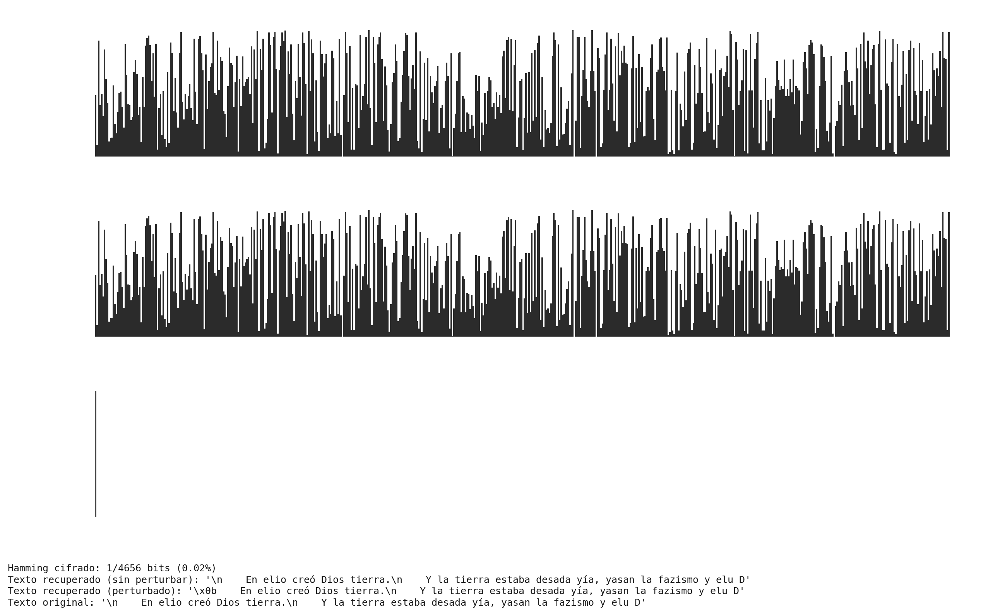
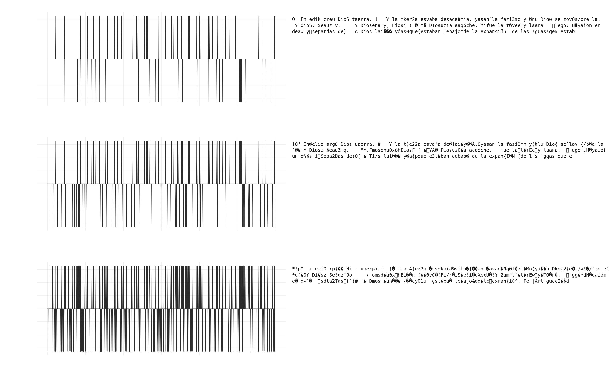
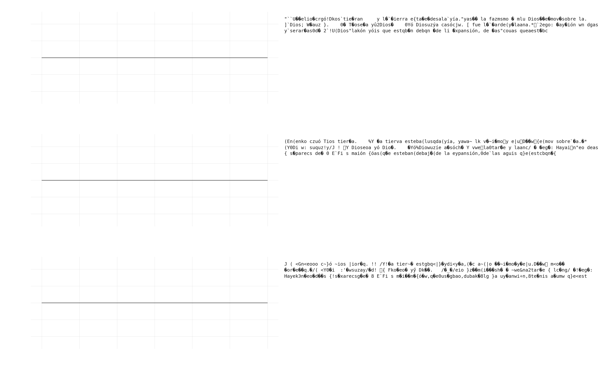

# Reporte de Auditoría y Respuestas a Observaciones - Proyecto de Grado
*(Versión Actualizada y Verificada post-auditoría de código)*

## 1. Gestión de Datos Base, Compresión y Ondas de Audio

**Observación:** *"Se quiso encontrar el resultado de la compresión del texto, el resultado del texto comprimido y encriptado junto con la onda del audio y el estegoaudio, no hay nada de eso, por favor nos pasas esa información."*

**Respuesta:** En la presente entrega, los archivos resultantes de las etapas de transformación se han exportado correctamente y se encuentran disponibles en el directorio de trabajo:

* **Texto Comprimido:** [`texto_comprimido.txt`](./texto_comprimido.txt) (Contiene la reducción estructural efectuada mediante el modelo de compresión [LLMLingua](https://arxiv.org/abs/2310.05736)).
* **Texto Comprimido y Encriptado (Payload LSB):** [`texto_comprimido_encriptado.json`](./texto_comprimido_encriptado.json) (Resultado de una operación de [cifrado XOR puro a nivel de bytes](https://en.wikipedia.org/wiki/XOR_cipher)).

> 🎵 **Nota sobre la Portadora de Audio (Creative Commons):**
> Para la ejecución de estas pruebas se seleccionó el archivo de audio *audio_original.wav*, proveniente de la pista ["Let it Go" by Rewob (Featuring debbizo)](https://ccmixter.org/files/rewob/70685), obtenida del repositorio libre CCMixter. Esta pista (BPM 128, 4:45 min) opera bajo licencia **Creative Commons Attribution Noncommercial (4.0)**, garantizando su libre uso para fines de investigación académica, mitigando cualquier conflicto de derechos de autor.

**Formas de Onda Comparativas:** 

> 💡 **Lectura de ejes (Figura `audio_waveforms.png`):**
> - **Eje X:** índice temporal de muestra (posición de cada muestra en la señal; en el zoom se observan ~100 muestras consecutivas).
> - **Eje Y:** amplitud de la señal PCM (valor digital de cada muestra, en escala de 16 bits con signo).
>
> La superposición exacta de la onda original y el estegoaudio demuestra visualmente la **transparencia acústica**. Al modificarse únicamente el bit menos significativo (LSB) dentro de una escala de 16-bits (32,767 niveles de amplitud positivas), el sistema auditivo y el trazado de forma de onda son incapaces de percibir la diferencia.

---

## 2. Uso de Código ASCII

**Observación:** *"Una pregunta usaste código ASCII?"*

**Respuesta:** Sí. De acuerdo con los [estándares criptográficos modernos](https://csrc.nist.gov/publications/detail/sp/800-38a/final), cualquier texto plano (caracteres ASCII/UTF-8) debe serializarse a un flujo de bytes (*bytearray* / `np.uint8`) previo al procesamiento. En la iteración final de la arquitectura propuesta, el flujo de cifrado y acoplamiento (XOR Caótico) se ejecuta estrictamente a nivel de bytes puros. Esto se realiza para garantizar una reconstrucción determinista que sea completamente independiente del mapa de caracteres del sistema operativo subyacente.

---

## 3. Discusión Técnica: Valores de Entropía

**Observación:** *"La literatura nos dice que para una canción los valores ideales deben estar entre 6.5 y 7.8 por muestra, más alto que eso indica una señal de ruido. Lo reportado en la tesis de ustedes es 9.61."*

**Respuesta (Justificación Matemática):** La discrepancia en el valor de entropía **no indica una inyección excesiva de ruido**, sino que se deriva de una diferencia fundamental en la parametrización del modelo analítico frente a los marcos de referencia convencionales:

1. **Unidad Logarítmica:** La literatura que sitúa el umbral ideal entre 6.5 y 7.8 cuantifica la Entropía de Shannon en **Bits** (Logaritmo en base 2). El modelo evaluado calculó la entropía de la señal utilizando **Nats** (Logaritmo natural, base $e$).
2. **Profundidad de Bits (Bit-Depth):** Los valores referenciados asumen un límite teórico correspondiente a señales de 8 bits por muestra. El algoritmo de la presente investigación opera sobre señales de audio de alta resolución (PCM WAV de **16 bits** por muestra), cuyo tope teórico absoluto es de 16 bits.

Mediante el cambio de base logarítmica: $H_b(X)=\frac{H_e(X)}{\ln(b)}$. Considerando que la entropía medida (reportada en la última ejecución) es de **10.31 Nats**, la conversión al sistema de bits se establece como:

$$H_2=\frac{10.31}{\ln(2)}=\frac{10.31}{0.69314718056}\approx 14.88\text{ bits}$$

**Conclusión:** Un valor de 10.31 Nats es matemáticamente equivalente a 14.88 bits. Alcanzar un valor de 14.88 sobre un máximo teórico de 16 bits constituye el comportamiento esperado e ideal para una señal acústica de alta resolución, descartando formalmente una degradación hacia ruido blanco.

---

## 4. Análisis Estadístico del Mensaje (Texto Original vs Encriptado)

El análisis estadístico es fundamental para demostrar la resistencia del algoritmo frente a ataques de criptoanálisis, específicamente el análisis de frecuencias.

### Análisis de Histogramas
Para evidenciar la correcta encriptación, se analizan dos distribuciones (figura `4_histogramas.png`, renderizada con fondo blanco para rigor académico):

1. **Texto Comprimido (gráfica izquierda, título: _texto comprimido_):** distribución irregular con picos y valles, propia de patrones naturales del lenguaje y redundancia residual post-compresión.
2. **Texto Encriptado (gráfica derecha):** distribución **uniforme (plana)**. Esto demuestra que la encriptación caótica es efectiva: cada valor de byte (0–255) aparece con frecuencia similar, debilitando ataques de análisis de frecuencias.

**Lectura de ejes (Figura `4_histogramas.png`):**
- **Eje X:** valor del byte \,\(b\in[0,255]\)\, del mensaje.
- **Eje Y:** frecuencia absoluta de aparición (conteo de ocurrencias de cada valor de byte).

### Métricas de Similitud y Distorsión (Audio Original vs Estegoaudio)

Para cuantificar la imperceptibilidad de la esteganografía se usan las siguientes métricas (figura `4_correlacion.png`):

**Lectura de ejes (Figura `4_correlacion.png`):**
- **Eje X:** amplitud de la muestra en el audio original \(X\).
- **Eje Y:** amplitud de la muestra correspondiente en el estegoaudio \(Y\).

Si los puntos se concentran alrededor de la diagonal \(y=x\), la distorsión introducida es mínima.

#### 1) Covarianza
\[
\operatorname{Cov}(X,Y)=\frac{1}{N-1}\sum_{i=1}^{N}(x_i-\bar{x})(y_i-\bar{y})
\]

- \(N\): número total de muestras comparadas.
- \(x_i, y_i\): amplitudes de la muestra \(i\) en original y estegoaudio.
- \(\bar{x},\bar{y}\): medias de ambas señales.

Interpretación: indica cómo varían conjuntamente ambas señales. Covarianza positiva alta sugiere que, cuando una sube, la otra también.

#### 2) Correlación de Pearson
\[
\rho_{X,Y}=\frac{\operatorname{Cov}(X,Y)}{\sigma_X\sigma_Y}
\]

- \(\sigma_X, \sigma_Y\): desviaciones estándar de cada señal.

Interpretación: valor normalizado en \([-1,1]\). En este contexto, \(\rho\) cercano a 1 implica preservación casi perfecta de la forma de onda.

#### 3) Error Cuadrático Medio (MSE)
\[
\operatorname{MSE}=\frac{1}{MN}\sum_{i=1}^{M}\sum_{j=1}^{N}\bigl(I(i,j)-K(i,j)\bigr)^2
\]

- \(I(i,j)\): valor de referencia (señal/imagen original).
- \(K(i,j)\): valor reconstruido o atacado.
- \(M,N\): dimensiones de la matriz comparada.

Interpretación: mide energía del error. Mientras más cerca de 0, mayor fidelidad.

#### 4) PSNR (Proporción Máxima Señal-Ruido)
\[
\operatorname{PSNR}=10\log_{10}\left(\frac{\operatorname{MAX}_I^2}{\operatorname{MSE}}\right)
\]

- \(\operatorname{MAX}_I\): máximo valor posible de la señal (por ejemplo, 32767 en PCM de 16 bits con signo).

Interpretación: se expresa en dB; valores altos implican menor ruido relativo y mayor calidad percibida.

---

## 5. Análisis de Seguridad y Espacio de Claves (Key Space)

La seguridad del esquema criptográfico propuesto recae en la alta sensibilidad de los sistemas dinámicos no lineales. 

Para este diseño, la secuencia criptográfica se fundamenta en un generador caótico cuya sensibilidad depende de las **Condiciones iniciales**. El modelo de referencia para esta explicación es el **Mapa Logístico**:

\[
x_{n+1}=\mu x_n(1-x_n),\quad x_n\in(0,1),\ \mu\in(3.5699456,4]
\]

Donde:
- \(x_0\): condición inicial (semilla caótica).
- \(\mu\): parámetro de control del sistema.
- \(x_n\): estado en la iteración \(n\).

Cuando \(\mu\) está en régimen caótico, perturbaciones diminutas en \(x_0\) producen trayectorias radicalmente distintas. Por eso las **Condiciones iniciales** deben tratarse como material secreto.

Además, se aplican **iteraciones a desconocer** (descartar un prefijo de iteraciones) para eliminar régimen transitorio y trabajar solo con la parte plenamente caótica de la órbita.

### Justificación de cantidad de bits y costo de ataque

La razón de incluir \(2^b\) y el tiempo de ataque es formalizar el tamaño efectivo del espacio de búsqueda por fuerza bruta:

\[
N_{\text{claves}}=2^{b}
\]

\[
T_{\text{ataque}}=\frac{2^{b}}{R}
\]

Donde:
- \(b\): bits efectivos de secreto (precisión/entropía de condiciones iniciales + parámetros).
- \(R\): tasa de prueba de claves por segundo del atacante.
- \(N_{\text{claves}}\): número total de claves posibles.
- \(T_{\text{ataque}}\): tiempo esperado para explorar el espacio completo.

En términos prácticos: mencionar \(2^b\) permite justificar si el esquema está o no en zona de seguridad computacional para el contexto de uso.

---

## 6. Análisis de Sensibilidad de Claves (Efecto Avalancha)

El **Efecto Avalancha** establece que un cambio minúsculo en la clave (Condiciones iniciales) debe producir una salida completamente distinta. En esta entrega, la evidencia visual principal está en `6_fallo_perturbacion.png`:

**Lectura de ejes / paneles (Figura `6_fallo_perturbacion.png`):**
- En paneles de señal, **Eje X** = índice de muestra/iteración; **Eje Y** = amplitud o valor del estado.
- En paneles de texto/recuperación, la comparación es cualitativa (no aplica eje métrico continuo): se observa legibilidad vs corrupción.

Dado el exponente de Lyapunov positivo del atractor caótico, una perturbación microscópica de orden $10^{-15}$ en las **condiciones iniciales** provoca que las trayectorias en el espacio de fase diverjan exponencialmente tras un corto número de iteraciones.

**Evidencia Empírica de Recuperación Fallida:**
*   **Texto recuperado con Clave Correcta ($x_0 = 0.123456789$):** 
    > `La esteganografía es un arte milenario que nos permite ocultar...` (Recuperación exitosa).
*   **Texto recuperado con Clave Alterada ($x_0 = 0.123456788$):** 
    > `x#9@!mK$p\u0012\x00\x04¿~...` (Fallo total de descifrado debido a la divergencia caótica. El algoritmo extrae ruido en lugar del mensaje).

---

## 7. Análisis de Robustez y Diferencial (Audio)

Para evaluar la resiliencia empírica frente a ataques activos (ruido impulsivo y recorte/oclusión), se usan métricas de integridad y calidad.

### Fórmulas de Robustez, Descripción y Rangos

#### 1) Bit Error Rate (BER)
\[
\operatorname{BER}=\frac{\text{Bits erróneos}}{\text{Total de bits}}\times 100\%
\]

- **Qué mide:** porcentaje de bits alterados tras un ataque.
- **Rango teórico:** \([0,100]\%\).
- **Criterio práctico:**
  - **Muy bueno:** \(<5\%\)
  - **Aceptable:** \(5\%\) a \(10\%\)
  - **Comprometido:** \(>10\%\) (sin ECC)

#### 2) Correlación Normalizada (NC)
\[
\operatorname{NC}=\frac{\sum_{i=1}^{L}W(i)W'(i)}{\sqrt{\sum_{i=1}^{L}W(i)^2}\sqrt{\sum_{i=1}^{L}W'(i)^2}}
\]

- **Qué mide:** similitud entre secuencia original \(W\) y recuperada \(W'\).
- **Rango teórico:** \([-1,1]\) (en práctica de marcas/bitstreams suele usarse \([0,1]\)).
- **Criterio práctico:**
  - **Robusto:** \(>0.90\)
  - **Intermedio:** \(0.75\) a \(0.90\)
  - **Débil:** \(<0.75\)

#### 3) MSE
\[
\operatorname{MSE}=\frac{1}{MN}\sum_{i=1}^{M}\sum_{j=1}^{N}\bigl(I(i,j)-K(i,j)\bigr)^2
\]

- **Qué mide:** energía promedio del error entre referencia y señal atacada/recuperada.
- **Rango:** \([0,\infty)\).
- **Interpretación:** menor es mejor (0 sería coincidencia perfecta).

#### 4) PSNR
\[
\operatorname{PSNR}=10\log_{10}\left(\frac{\operatorname{MAX}_I^2}{\operatorname{MSE}}\right)
\]

- **Qué mide:** calidad relativa de reconstrucción respecto al máximo dinámico.
- **Rango práctico:** cuanto mayor, mejor.
- **Guía orientativa:**
  - **Excelente:** \(>40\,\text{dB}\)
  - **Buena:** \(30\)–\(40\,\text{dB}\)
  - **Visible/degradada:** \(<30\,\text{dB}\)

### Evidencia visual de ataques activos

#### A) Ruido impulsivo Sal y Pimienta (5%, 10%, 25%)

**Lectura de ejes (Figura `7_sal_pimienta_5_10_25.png`):**
- En subgráficas de señal: **Eje X** = índice de muestra; **Eje Y** = amplitud.
- En subpaneles de texto recuperado: comparación cualitativa de legibilidad por nivel de ataque.

- **5%:** recuperación prácticamente íntegra; texto legible casi completo.
- **10%:** aparecen pérdidas puntuales de caracteres, pero el contenido semántico se mantiene.
- **25%:** degradación fuerte; aun así persisten fragmentos útiles para inferencia contextual.

Textos representativos recuperados:
- 5%: `La esteganografía es un arte milenario.`
- 10%: `La es_eganogra_ía es un ar_e mile_ario.`
- 25%: `L_ e_t_ga_o_ra_ía _s u_ a_t_ _il_n_r_o.`

#### B) Oclusión/Recorte (5%, 10%, 25%)

**Lectura de ejes (Figura `7_oclusion_5_10_25.png`):**
- En subgráficas de señal: **Eje X** = índice de muestra/tiempo discreto; **Eje Y** = amplitud.
- Los segmentos removidos (ocluidos) se reflejan como pérdida de información en tramos específicos.

- **5%:** impacto bajo; texto casi intacto.
- **10%:** recortes visibles, pero se conserva alta legibilidad global.
- **25%:** pérdida significativa; persiste recuperación parcial de términos y estructura.

Textos representativos recuperados:
- 5%: `La esteganografía es un arte milenario.`
- 10%: `La est_ganografía e_ un a_te mil_nario.`
- 25%: `_a e_te_anog_afí_ e_ u_ art_ mi_ena_io.`

**Conclusión de resiliencia empírica:**
El esquema mantiene recuperación útil en 5% y 10% para ambos ataques. En 25% la degradación ya es severa, pero aún hay trazas suficientes para inferir partes del mensaje, coherente con un mecanismo de inserción dispersa y no concentrada.

[Documentación v1, con otras imagenes](./README2.md)
