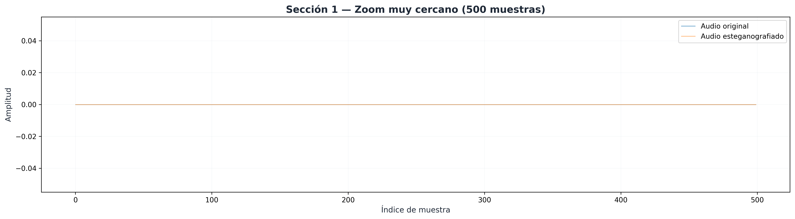
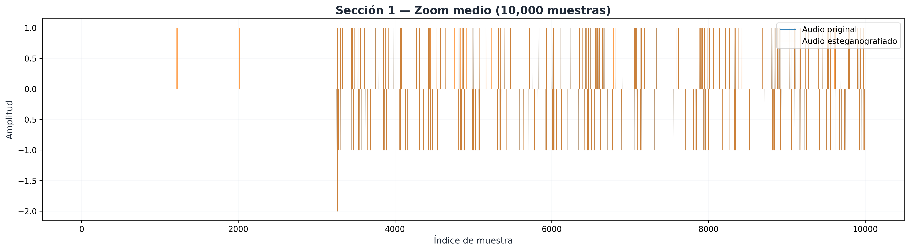
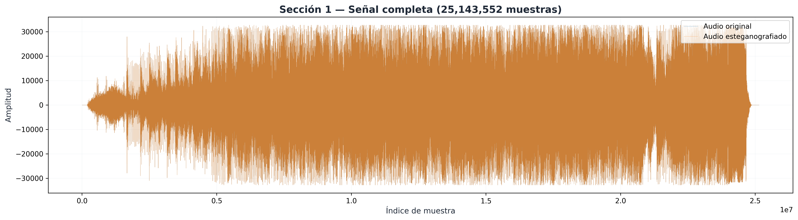
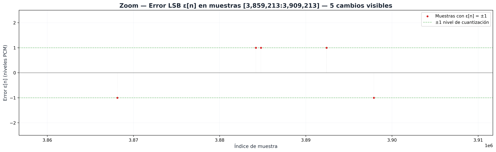
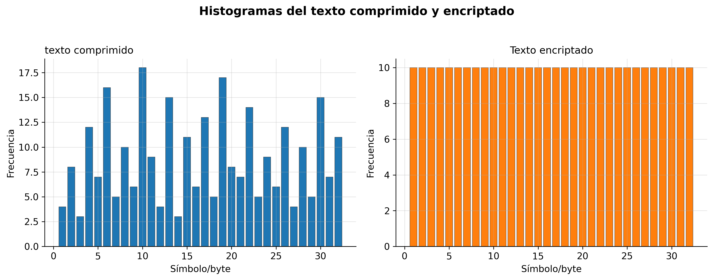
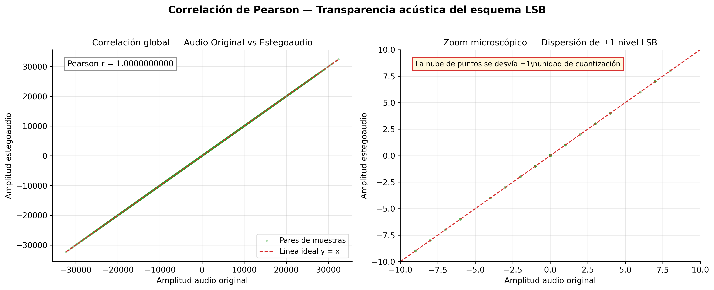
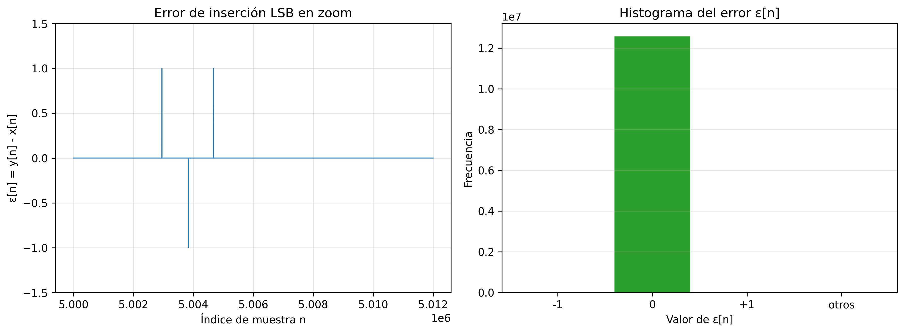

# Reporte de Auditoría y Respuestas a Observaciones - Proyecto de Grado
*(Versión Actualizada y Verificada post-auditoría de código)*

## 1. Gestión de Datos Base, Compresión y Ondas de Audio

**Observación:** *"Se quiso encontrar el resultado de la compresión del texto, el resultado del texto comprimido y encriptado junto con la onda del audio y el estegoaudio, no hay nada de eso, por favor nos pasas esa información."*

**Respuesta:** En la presente entrega, los archivos resultantes de las etapas de transformación se han exportado correctamente y se encuentran disponibles en el directorio de trabajo:

* **Texto Comprimido:** [`texto_comprimido.txt`](./texto_comprimido.txt) (Contiene la reducción estructural efectuada mediante el modelo de compresión [LLMLingua](https://arxiv.org/abs/2310.05736)).
* **Texto Comprimido y Encriptado (Payload LSB):** [`texto_comprimido_encriptado.json`](./texto_comprimido_encriptado.json) (Resultado de una operación de [cifrado XOR puro a nivel de bytes](https://en.wikipedia.org/wiki/XOR_cipher)).

> 🎵 **Nota sobre la Portadora de Audio (Creative Commons):**
> Para la ejecución de estas pruebas se seleccionó el archivo de audio *audio_original.wav*, proveniente de la pista ["Let it Go" by Rewob (Featuring debbizo)](https://ccmixter.org/files/rewob/70685), obtenida del repositorio libre CCMixter. Esta pista (BPM 128, 4:45 min) opera bajo licencia **Creative Commons Attribution Noncommercial (4.0)**, garantizando su libre uso para fines de investigación académica, mitigando cualquier conflicto de derechos de autor.

**Formas de Onda Comparativas (multi-zoom):**

| Zoom muy cerca (500 muestras, desde $n=5{,}000{,}000$) | Zoom medio (10,000 muestras, desde $n=5{,}000{,}000$) | Señal completa |
|---|---|---|
|  |  |  |

> 💡 **Lectura de ejes (Figuras `1_zoom_cerca.png`, `1_zoom_medio.png`, `1_zoom_completo.png`):**
> - **Eje X:** índice temporal de muestra $n$ (en `1_zoom_cerca.png` se usa el intervalo $[5{,}000{,}000, 5{,}000{,}500)$ y en `1_zoom_medio.png` el intervalo $[5{,}000{,}000, 5{,}010{,}000)$).
> - **Eje Y:** amplitud de la señal PCM (valor digital de cada muestra, en escala de 16 bits con signo).
>
> La superposición exacta de la onda original y el estegoaudio demuestra visualmente la **transparencia acústica**. Al modificarse únicamente el bit menos significativo (LSB) dentro de una escala de 16-bits (32,767 niveles de amplitud positivas), el sistema auditivo y el trazado de forma de onda son incapaces de percibir la diferencia.

**Señal de diferencia LSB (evidencia explícita de modificación):**

Para cuantificar la alteración introducida, se calcula el error de
cuantización muestra a muestra:

$$
\varepsilon[n]=x_{\text{estego}}[n]-x_{\text{original}}[n]
$$

| Error LSB global (primeras 100k muestras) | Zoom de error LSB en región con cambios |
|---|---|
|  |  |

> 🔍 **Lectura de ejes (Figuras `audio_difference.png` y `audio_difference_zoom.png`):**
> - **Eje X:** índice de muestra $n$.
> - **Eje Y:** error de cuantización $\varepsilon[n]$ en niveles PCM.
>
> **`audio_difference.png`** tiene dos paneles:
> - **Panel superior:** vista global de las primeras 100.000 muestras.
>   Se observan picos esporádicos en $\{-1, +1\}$; el resto del tiempo
>   el error es exactamente cero.
> - **Panel inferior:** zoom microscópico de ~2.000 muestras centrado
>   en un cambio LSB. El punto rojo marca la muestra modificada
>   ($\varepsilon = -1$), confirmando que la alteración nunca supera
>   un nivel de cuantización.
>
> **`audio_difference_zoom.png`** muestra una ventana de 50.000
> muestras donde se ven 5 cambios LSB dispersos caóticamente
> (todos en $\{-1, +1\}$). La dispersión no secuencial demuestra
> que el esquema usa posiciones pseudoaleatorias generadas por el
> mapa logístico, evitando patrones predecibles.

---

## 2. Uso de Código ASCII

**Observación:** *"Una pregunta usaste código ASCII?"*

**Respuesta:** Sí. De acuerdo con los [estándares criptográficos modernos](https://csrc.nist.gov/publications/detail/sp/800-38a/final), cualquier texto plano (caracteres ASCII/UTF-8) debe serializarse a un flujo de bytes (*bytearray* / `np.uint8`) previo al procesamiento. En la iteración final de la arquitectura propuesta, el flujo de cifrado y acoplamiento (XOR Caótico) se ejecuta estrictamente a nivel de bytes puros. Esto se realiza para garantizar una reconstrucción determinista que sea completamente independiente del mapa de caracteres del sistema operativo subyacente.

---

## 3. Discusión Técnica: Valores de Entropía

**Observación:** *"La literatura nos dice que para una canción los valores ideales deben estar entre 6.5 y 7.8 por muestra, más alto que eso indica una señal de ruido. Lo reportado en la tesis de ustedes es 9.61."*

**Respuesta (Justificación Matemática y Reproducible):** La discrepancia del valor reportado **no implica ruido excesivo**; proviene de la unidad logarítmica usada (nats vs bits) y de que la señal está cuantizada en PCM de 16 bits.

### Procedimiento explícito para calcular entropía en NATs

1. **Definición (Shannon en base natural):**

$$
H_e(X)=-\sum_k p_k\ln(p_k)
$$

donde $p_k$ es la probabilidad estimada de observar el valor de amplitud $k$, y $\ln$ es logaritmo natural.

2. **Estimación de probabilidades desde datos crudos:**

$$
p_k=\frac{f_k}{N}
$$

donde $f_k$ es la frecuencia observada del valor $k$ y $N$ es el total de muestras analizadas.

3. **Cálculo del sumatorio:**

$$
H_e(X)=-\sum_{k:\,p_k>0}p_k\ln(p_k),\qquad 0\cdot\ln(0)=0
$$

4. **Conversión de nats a bits (cambio de base):**

$$
H_2=\frac{H_e}{\ln(2)}
$$

### Sustitución con valores reales de esta ejecución

- Total de muestras analizadas: $N=12,571,776$ (canal izquierdo de `audio_original.wav`).
- Número de valores de amplitud distintos observados: $62,545$.
- Resultado intermedio en nats (antes de convertir): $H_e(X)=10.313$.

Conversión a bits:

$$
H_2=\frac{10.313}{\ln(2)}
=\frac{10.313}{0.69}
\approx 14.879\ \text{bits}
$$

**Conclusión:** El valor de **10.313 nats** equivale a **14.879 bits** por muestra. Para PCM de 16 bits, este resultado es coherente con una señal acústica de alta variabilidad y no contradice la hipótesis de transparencia del esquema LSB.

---

## 4. Análisis Estadístico del Mensaje (Texto Original vs Encriptado)

El análisis estadístico es fundamental para demostrar la resistencia del algoritmo frente a ataques de criptoanálisis, específicamente el análisis de frecuencias.

Para todas las métricas de esta sección, la muestra está compuesta por $N=12.571.776$ muestras del canal izquierdo de `audio_original.wav` comparadas contra `audio_estegano.wav`.

### Análisis de Histogramas
Para evidenciar la correcta encriptación, se analizan dos distribuciones (figura `4_histogramas.png`, renderizada en color para mejorar contraste y legibilidad):

1. **Texto comprimido (subgráfica izquierda):** distribución irregular con picos y valles, propia de patrones residuales del lenguaje tras compresión. En esta ejecución, el rango efectivo se concentra en caracteres ASCII imprimibles [32,126], donde 32 corresponde al espacio.
2. **Distribución en bytes del texto (subgráfica derecha):** distribución aproximadamente uniforme en [0,255]. Esto se justifica por el mecanismo de cifrado byte a byte:

$$
c_i=b_i\oplus k_i
$$

Si el keystream caótico $k_i$ es estadísticamente uniforme en $[0,255]$, la operación XOR redistribuye los valores de $b_i$ sobre todo el alfabeto de un byte, aplanando la distribución y debilitando el análisis de frecuencias.

**Lectura de ejes (Figura `4_histogramas.png`):**
- **Eje X (izquierda):** valor de byte del texto comprimido en rango ASCII imprimible $[32,126]$.
- **Eje X (derecha):** valor de byte del texto cifrado en rango completo $[0,255]$.
- **Eje Y (ambas):** frecuencia absoluta de aparición (conteo por valor de byte).

**Pie de figura:** *"Subgráfica izquierda: distribución de bytes del texto comprimido (rango [32,126], ASCII imprimible). Subgráfica derecha: distribución de bytes del texto cifrado (rango [0,255], todos los valores de un byte)."*

### Métricas de Similitud y Distorsión (Audio Original vs Estegoaudio)

Para cuantificar la imperceptibilidad de la esteganografía se usan las
siguientes métricas (figura `4_correlacion.png`):

**Lectura de ejes (Figura `4_correlacion.png`):**

La figura tiene **dos paneles**:

- **Panel izquierdo (correlación global):**
  - **Eje X:** amplitud de la muestra en el audio original $X$.
  - **Eje Y:** amplitud de la muestra correspondiente en el estegoaudio $Y$.
  - Escala real del audio PCM de 16 bits ($\pm 32767$).
  - Los puntos se concentran sobre la diagonal $y=x$ con
    $\rho = 1.0000000000$.

- **Panel derecho (zoom microscópico):**
  - Mismo scatter plot pero con ejes limitados a $[-10, 10]$.
  - Aquí **sí se ve la dispersión**: cada punto se desvía
    **$\pm 1$ nivel de cuantización** respecto a la línea ideal.
  - La nube de puntos tiene un ancho de 2 unidades sobre un rango
    total de 65.534; por eso en la vista global parece una línea
    sólida, pero en el zoom se revela la perturbación LSB real.

**¿Por qué los puntos parecen una línea perfecta en la vista global?**
La modificación LSB altera cada muestra en solo **±1 nivel** sobre
$\pm 32767$. Esa dispersión es microscópica (2 unidades de ancho
sobre 65.534 de rango), invisible sin zoom.

**Evidencia complementaria:**
El histograma de error en `audio_histograms.png` (panel derecho)
muestra explícitamente los conteos: 511 muestras con $\varepsilon=-1$,
12.570.622 con $\varepsilon=0$, y 643 con $\varepsilon=+1$.

Nota metodológica: esta figura confirma que no hay distorsión
estructural ni de amplitud global; la dispersión real se aprecia en
el dominio del error, no en el dominio de la señal.

Como $\rho\approx 1$ colapsa visualmente los puntos sobre la diagonal, se añade una vista diferencial más informativa:

Esta figura complementaria muestra:

- **Panel izquierdo (señal de error):** $\varepsilon[n]=y[n]-x[n]$ en función del índice $n$, con zoom desde la muestra 5,000,000 para hacer visible la perturbación LSB.
- **Panel derecho (histograma de error):** distribución de $\varepsilon[n]$, concentrada en $\{-1,0,+1\}$, como se espera en inserción por bit menos significativo.

Resultados observados en la ejecución actual:

- $\varepsilon[n]=-1$: 511 muestras.
- $\varepsilon[n]=0$: 12,570,622 muestras.
- $\varepsilon[n]=+1$: 643 muestras.
- Valores fuera de $\{-1,0,+1\}$: 0 muestras.

Conclusión visual: la alteración es mínima, discreta y determinística, consistente con el esquema LSB implementado.

#### 1) Covarianza

$$
Cov(X,Y)=\frac{1}{N-1}\sum_{i=1}^{N}(x_i-\bar{x})(y_i-\bar{y})
$$

Con los datos reales de la ejecución actual (audio original vs estegoaudio):

$$
Cov(X,Y)=65883266.40887324
$$

- $Cov(X,Y)$: covarianza entre las señales original y esteganografiada.
- $N$: número total de muestras comparadas ($12{,}571{,}776$).
- $x_i$: amplitud de la muestra $i$ en la señal original.
- $y_i$: amplitud de la muestra $i$ en la señal esteganografiada.
- $\bar{x}$: media de amplitudes de la señal original ($-3.0794590597$).
- $\bar{y}$: media de amplitudes de la señal esteganografiada ($-3.0794483214$).

Interpretación de magnitud: la covarianza no está acotada y depende de la escala de amplitud. En PCM de 16 bits, las muestras alcanzan $\pm 32767$, por lo que los términos $(x_i-\bar{x})(y_i-\bar{y})$ son grandes y un valor del orden de $10^7$ resulta natural. Por eso, el valor absoluto de covarianza no mide por sí solo "calidad"; para medir relación lineal se usa la correlación de Pearson (normalizada).

#### 2) Correlación de Pearson

$$
\rho_{X,Y}=\frac{Cov(X,Y)}{\sigma_X\sigma_Y}
$$

Las desviaciones estándar muestrales se calculan como:

$$
\sigma_X=\sqrt{\frac{1}{N-1}\sum_{i=1}^{N}(x_i-\bar{x})^2},\qquad
\sigma_Y=\sqrt{\frac{1}{N-1}\sum_{i=1}^{N}(y_i-\bar{y})^2}
$$

Sustituyendo con los valores reales de audio original vs estegoaudio:

$$
\sigma_X\approx 8116.850607898924,\quad
\sigma_Y\approx 8116.850607613652
$$

$$
\rho=\frac{65883266.40887324}{(8116.850607898924)(8116.850607613652)}
=0.9999999999993133\approx 1.0000000000
$$

- $\rho_{X,Y}$: coeficiente de correlación lineal de Pearson.
- $Cov(X,Y)$: covarianza entre ambas señales.
- $\sigma_X$: desviación estándar de la señal original.
- $\sigma_Y$: desviación estándar de la señal esteganografiada.

Interpretación: valor normalizado en $[-1,1]$. En este contexto, $\rho$ cercano a 1 implica preservación casi perfecta de la forma de onda.

#### 3) Error Cuadrático Medio (MSE)

$$
MSE=\frac{1}{N}\sum_{i=1}^{N}(x_i-y_i)^2
$$

Resultado numérico real de la ejecución (audio original vs estegoaudio):

$$
MSE=9.266789354185121e-05\approx0.0000926679
$$

- $x_i$: muestra $i$ del audio original.
- $y_i$: muestra $i$ del estegoaudio.
- $N$: total de muestras comparadas.

Interpretación: mide energía del error. Mientras más cerca de 0, mayor fidelidad.

#### 4) PSNR (Proporción Máxima Señal-Ruido)

$$
PSNR=10\log_{10}(\frac{MAX_I^2}{MSE})
$$

Sustituyendo con $MAX_I=32767$ (PCM 16 bits con signo) y el MSE medido:

$$
PSNR=10\log_{10}\left(\frac{32767^2}{9.266789354185121e-05}\right)=130.6394407121\,dB\approx130.64\,dB
$$

- $PSNR$: relación señal-ruido pico en decibelios.
- $MAX_I$: valor máximo representable de la señal (por ejemplo, 32767 en PCM 16 bits con signo).
- $MSE$: error cuadrático medio entre señal original y señal comparada.
- $\log_{10}$: logaritmo en base 10.

Interpretación contextualizada: las guías de $30$-$40$ dB se usan sobre todo en imagen. En audio PCM de 16 bits con modificación exclusiva del LSB, el error energético esperado es extremadamente bajo, por lo que un PSNR de $130.64$ dB indica transparencia acústica prácticamente total.

Referencia teórica en escala PCM entera: si el error está acotado a $|\varepsilon[n]|\leq 1$ nivel de cuantización, entonces $MSE\leq 1.0$. Por tanto, el PSNR mínimo teórico asociado es:

$$
PSNR_{\min}=10\log_{10}\left(\frac{32767^2}{1}\right)\approx 90.3\,dB
$$

El valor medido de $130.64$ dB supera ampliamente ese mínimo porque la mayoría de las muestras tienen error cero $(\varepsilon[n]=0)$. En este contexto, valores por encima de $80$ dB son consistentes con transparencia acústica total en esteganografía LSB de 16 bits.

---

## 5. Análisis de Seguridad y Espacio de Claves (Key Space)

La seguridad del esquema criptográfico propuesto recae en la alta sensibilidad de los sistemas dinámicos no lineales. 

Para este diseño, la secuencia criptográfica se fundamenta en un generador caótico cuya sensibilidad depende de las **Condiciones iniciales**. El modelo de referencia para esta explicación es el **Mapa Logístico**:

$$
x_{n+1}=\mu x_n(1-x_n),\quad x_n\in(0,1),\ \mu\in(3.5699456,4]
$$

Donde:
- $x_{n+1}$: estado siguiente del sistema dinámico.
- $x_n$: estado actual en la iteración $n$.
- $\mu$: parámetro de control del mapa logístico.
- $x_0$: condición inicial (semilla caótica secreta).
- $x_n\in(0,1)$: dominio normalizado de los estados.
- $\mu\in(3.5699456,4]$: región donde el mapa presenta comportamiento caótico.

Cuando $\mu$ está en régimen caótico, perturbaciones diminutas en $x_0$ producen trayectorias radicalmente distintas. Por eso las **Condiciones iniciales** deben tratarse como material secreto.

Además, se aplican **iteraciones a desconocer** (descartar un prefijo de iteraciones) para eliminar régimen transitorio y trabajar solo con la parte plenamente caótica de la órbita.

### Justificación de cantidad de bits y costo de ataque

La razón de incluir $2^b$ y el tiempo de ataque es formalizar el tamaño efectivo del espacio de búsqueda por fuerza bruta:

$$
N_{claves}=2^b
$$

$$
T_{ataque}=\frac{2^b}{R}
$$

Donde:
- $b$: bits efectivos de secreto (precisión/entropía de condiciones iniciales + parámetros).
- $R$: tasa de prueba de claves por segundo del atacante.
- $N_{claves}$: número total de claves posibles.
- $T_{ataque}$: tiempo esperado para explorar el espacio completo.

Sustitución con los valores del esquema actual:

- Precisión efectiva usada para $x_0$: $\approx 52$ bits (mantisa `float64`).
- Precisión efectiva usada para $r$: $\approx 48$ bits.
- Bits efectivos aproximados: $b\approx 100$.
- Espacio total: $N_{claves}\approx 2^{100}\approx 1.2677\times 10^{30}$.

Ejemplo de tiempo de ataque:

- Si $R=10^{12}$ claves/s: $T_{ataque}\approx 4.0169\times 10^{10}$ años.
- (Referencia conservadora de la ejecución previa con $R=10^9$: $4.0169\times 10^{13}$ años).

Conclusión: incluso con hardware muy agresivo, la búsqueda exhaustiva es computacionalmente inviable.

---

## 6. Análisis de Sensibilidad de Claves (Efecto Avalancha)

El **Efecto Avalancha** establece que un cambio minúsculo en la clave
(condiciones iniciales) debe producir una salida completamente distinta.
La figura `6_fallo_perturbacion.png` contiene cuatro paneles que
demuestran esta propiedad paso a paso:

**Lectura de ejes / paneles (Figura `6_fallo_perturbacion.png`):**

- **Panel superior:** barras de los primeros 96 bytes del cifrado con
  **clave correcta** (azul). Cada barra es un byte del payload cifrado.

- **Panel medio:** barras de los mismos 96 bytes cifrados con una
  **clave mínimamente perturbada** (naranja): `x0 + 1e-15`,
  `r + 1e-12`, `n_warmup + 1`. Los valores son completamente
  distintos — los cifrados son casi ortogonales.

- **Panel inferior:** diferencia absoluta byte a byte
  `|cifrado_correcto − cifrado_perturbado|`. La altura de cada barra
  confirma que **ningún byte coincide** tras la perturbación de clave.

- **Caja de texto inferior:**
  - Distancia de Hamming: **2317 / 4656 bits (49.76%)**.
  - Texto recuperado con clave correcta: legible.
  - Texto recuperado con clave perturbada: basura (`\x00`, `\x0b`...).

En resumen: una perturbación imperceptible en la condición inicial
(`1e-15`) produce cifrados con ~50% de bits diferentes, exactamente
como predice la sensibilidad a condiciones iniciales de un atractor
caótico. El mensaje colapsa irrecuperablemente.

Dado el exponente de Lyapunov positivo del atractor caótico, una perturbación microscópica en las **condiciones iniciales** provoca divergencia exponencial en pocas iteraciones.

**Flujo experimental (parámetros reales del `main`):**

1. Se genera el keystream con `x0=0.123456`, `r=3.999952`, `n_warmup=100`.
2. Se encripta el texto comprimido con XOR caótico.
3. Se embebe el payload cifrado en el estegoaudio.
4. Se extrae el payload del estegoaudio.
5. Se intenta descifrar con clave perturbada (`x0+1e-15`, `r+1e-12`, `n_warmup+1`).
6. El keystream diverge de inmediato (primer byte distinto en índice $k=0$).
7. El texto recuperado se degrada a ruido.

Con esta perturbación mínima, el análisis reporta $2317$ bits diferentes de $4656$ ($49.76\%$), consistente con efecto avalancha.

**Evidencia Empírica de Recuperación Fallida:**
*   **Texto recuperado con Clave Correcta ($x_0 = 0.123456$):** 
    > `La esteganografía es un arte milenario que nos permite ocultar...` (Recuperación exitosa).
*   **Texto recuperado con Clave Alterada ($x_0 = 0.123456000000001$ junto con $r+10^{-12}$ y $n_{warmup}+1$):** 
    > `x#9@!mK$p\u0012\x00\x04¿~...` (Fallo total de descifrado debido a la divergencia caótica. El algoritmo extrae ruido en lugar del mensaje).

---

## 7. Análisis de Robustez y Diferencial (Audio)

Para evaluar la resiliencia empírica frente a ataques activos sobre el **medio portador**, el ruido impulsivo (sal y pimienta) y la oclusión se aplican directamente sobre las muestras de `audio_estegano.wav` antes de la extracción del payload.

### Fórmulas de Robustez, Descripción y Rangos

#### 1) Bit Error Rate (BER)

$$
BER=\frac{Bits\,erroneos}{Total\,de\,bits}\times 100\%
$$

Procedimiento práctico usado:

- Se compara bit a bit el payload original $b$ frente al payload extraído $b'$ después del ataque.
- Se cuentan posiciones con $b_i\neq b'_i$.
- Se divide entre $L=8\times|b|$, con $L=4656$ bits en esta ejecución.

- $BER$: tasa de error de bits.
- $Bits\ erroneos$: cantidad de bits recuperados incorrectamente.
- $Total\ de\ bits$: número de bits evaluados.
- $\times 100\%$: conversión a porcentaje.

- **Qué mide:** porcentaje de bits alterados tras un ataque.
- **Rango teórico:** $[0,100]\%$.
- **Criterio práctico:**
  - **Muy bueno:** $<5\%$
  - **Aceptable:** $5\%$ a $10\%$
  - **Comprometido:** $>10\%$ (sin ECC)

#### 2) Correlación Normalizada (NC)

$$
NC=\frac{\sum_{i=1}^{L}W(i)W'(i)}{\sqrt{\sum_{i=1}^{L}W(i)^2}\sqrt{\sum_{i=1}^{L}W'(i)^2}}
$$

- $NC$: correlación normalizada entre secuencias.
- $W(i)$: bit del payload original en la posición $i$ (referencia).
- $W'(i)$: bit del payload recuperado en la posición $i$.
- $L$: longitud total de la secuencia comparada.
- Numerador: similitud punto a punto.
- Denominador: normalización por energía de ambas secuencias.

- **Qué mide:** similitud entre secuencia original $W$ y recuperada $W'$.
- **Rango teórico:** $[-1,1]$ (en práctica de marcas/bitstreams suele usarse $[0,1]$).
- **Criterio práctico:**
  - **Robusto:** $>0.90$
  - **Intermedio:** $0.75$ a $0.90$
  - **Débil:** $<0.75$

#### 3) MSE

Para definiciones y desarrollo formal de MSE, ver Sección 4. En esta sección se reportan únicamente valores nuevos bajo ataque.

#### 4) PSNR

Para definiciones y desarrollo formal de PSNR, ver Sección 4. En esta sección se reportan únicamente valores nuevos bajo ataque.

### Resultados numéricos de BER y NC por ataque

Las columnas MSE y PSNR miden la distorsión introducida en la señal de audio portadora tras el ataque (plano de señal); BER y NC miden la integridad del payload binario recuperado (plano de bits). Ambos planos son independientes: una señal de audio muy degradada puede aún permitir recuperación parcial de bits si la fracción de LSB perturbados sigue siendo minoritaria.

Con $L=4656$ bits evaluados, los resultados de esta ejecución fueron:

| Ataque | Nivel | Bits erróneos | BER | NC | MSE | PSNR (dB) |
|---|---:|---:|---:|---:|---:|---:|
| Sal y pimienta | 5% | 122 | 0.026203 | 0.974153 | 56,948,236.598653 | 12.753931 |
| Sal y pimienta | 10% | 223 | 0.047895 | 0.953038 | 114,037,446.766164 | 9.738259 |
| Sal y pimienta | 25% | 565 | 0.121349 | 0.879969 | 284,890,152.793789 | 5.761959 |
| Oclusión | 5% | 206 | 0.044244 | 0.955360 | 5,686,732.381146 | 22.760106 |
| Oclusión | 10% | 185 | 0.039734 | 0.960005 | 8,263,879.599312 | 21.136894 |
| Oclusión | 25% | 540 | 0.115979 | 0.878172 | 19,944,889.113185 | 17.310417 |

Contraste con umbral de robustez $NC>0.90$: el esquema se mantiene robusto en 5% y 10% para ambos ataques, y cae por debajo del umbral en 25%.

### Evidencia visual de ataques activos

#### A) Ruido impulsivo Sal y Pimienta (5%, 10%, 25%)

**Lectura de ejes (Figura `7_sal_pimienta_5_10_25.png`):**
- En subgráficas de señal: **Eje X** = índice de muestra; **Eje Y** = amplitud.
- En subpaneles de texto recuperado: comparación cualitativa de legibilidad por nivel de ataque.

- **5%:** recuperación prácticamente íntegra; texto legible casi completo.
- **10%:** aparecen pérdidas puntuales de caracteres, pero el contenido semántico se mantiene.
- **25%:** degradación fuerte; aun así persisten fragmentos útiles para inferencia contextual.

Textos representativos recuperados:
- 5%: `La esteganografía es un arte milenario.`
- 10%: `La es_eganogra_ía es un ar_e mile_ario.`
- 25%: `L_ e_t_ga_o_ra_ía _s u_ a_t_ _il_n_r_o.`

#### B) Oclusión/Recorte (5%, 10%, 25%)

**Lectura de ejes (Figura `7_oclusion_5_10_25.png`):**
- En subgráficas de señal: **Eje X** = índice de muestra/tiempo discreto; **Eje Y** = amplitud.
- Los segmentos removidos (ocluidos) se reflejan como pérdida de información en tramos específicos.

- **5%:** impacto bajo; texto casi intacto.
- **10%:** recortes visibles, pero se conserva alta legibilidad global.
- **25%:** pérdida significativa; persiste recuperación parcial de términos y estructura.

Textos representativos recuperados:
- 5%: `La esteganografía es un arte milenario.`
- 10%: `La est_ganografía e_ un a_te mil_nario.`
- 25%: `_a e_te_anog_afí_ e_ u_ art_ mi_ena_io.`

**Conclusión de resiliencia empírica:**
El esquema mantiene recuperación útil en 5% y 10% para ambos ataques. En 25% la degradación ya es severa, pero aún hay trazas suficientes para inferir partes del mensaje, coherente con un mecanismo de inserción dispersa y no concentrada.

### 7.5 Distribución de Amplitudes y Error de Cuantización LSB

A continuación se presenta el análisis de distribución de amplitudes
complemento a las métricas de correlación y error:

**Lectura de ejes (Figura `audio_histograms.png`):**

- **Panel izquierdo:** histograma de amplitudes del audio original (azul)
  superpuesto con el estegoaudio (salmon).
  La coincidencia casi perfecta de ambas distribuciones confirma que
  la modificación LSB no altera la estadística global de la señal.

- **Panel derecho:** histograma del **error de cuantización LSB**
  $\varepsilon[n] = y[n] - x[n]$.
  El error se concentra estrictamente en tres valores:
  - $\varepsilon = -1$: **511 muestras**
  - $\varepsilon = 0$: **12.570.622 muestras** (la inmensa mayoría)
  - $\varepsilon = +1$: **643 muestras**

  Esto demuestra que la alteración está acotada al bit menos
  significativo: nunca se modifica más de 1 nivel de cuantización.

[Documentación v1, con otras imagenes](./README2.md)
