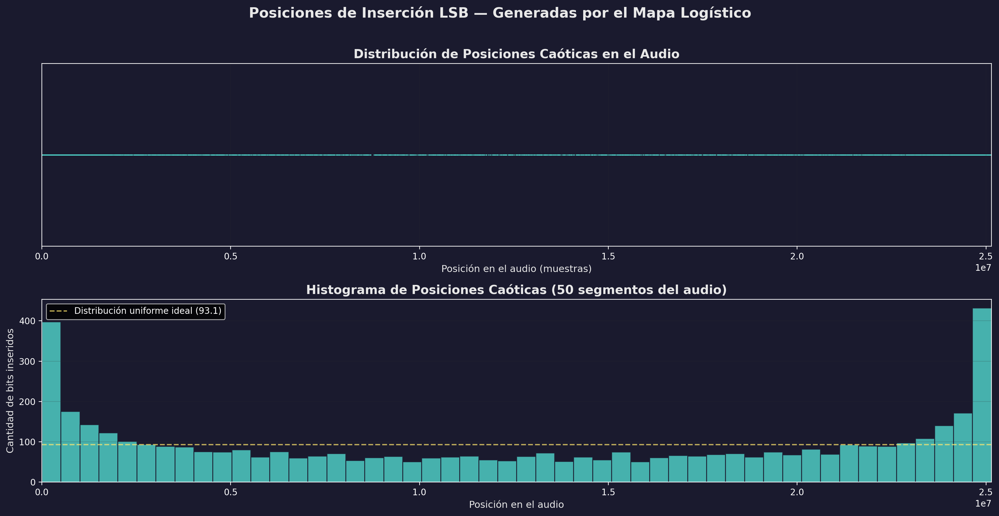
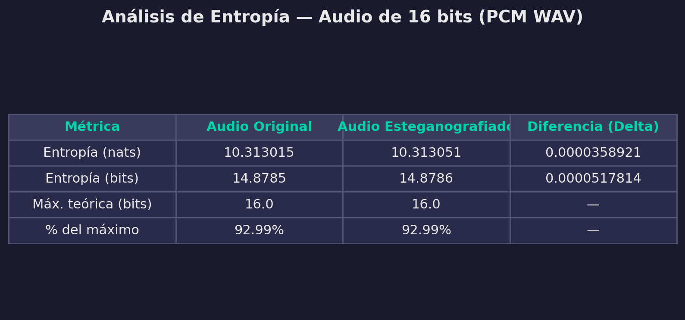
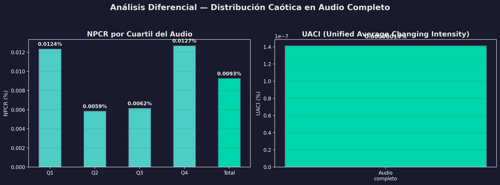
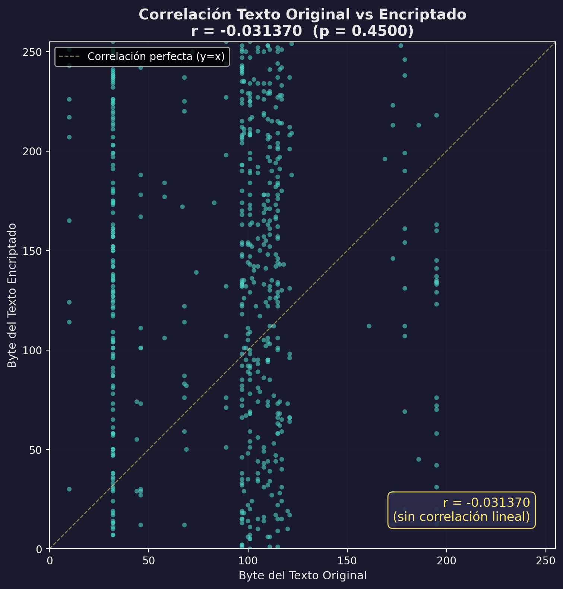
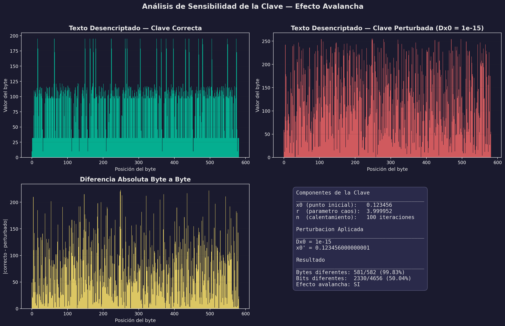
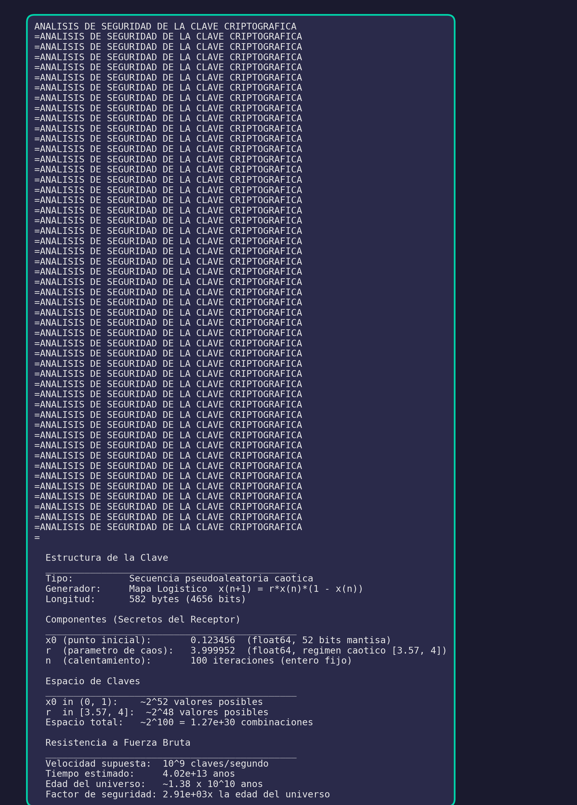
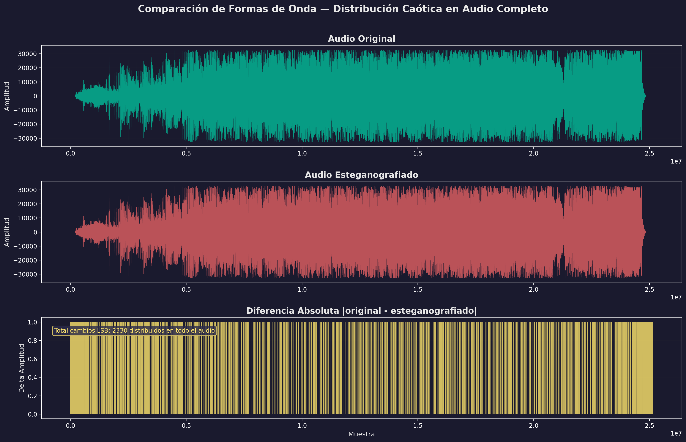

# Resultados de Análisis — Sistema de Esteganografía en Audio con Caos

---

## 1. Descripción General del Sistema

El sistema implementado oculta información textual dentro de un archivo de audio WAV (PCM 16 bits) utilizando un enfoque basado en **caos determinista**. El proceso completo se compone de tres etapas secuenciales que transforman el texto original hasta ocultarlo de forma imperceptible en la señal de audio.

### 1.1 Pipeline Completo

```
Texto original (español)
    │
    ▼
┌─────────────────────────┐
│  1. COMPRESIÓN           │  LLMLingua (modelo de lenguaje)
│     Reduce redundancia   │  ~80% de las palabras conservadas
└────────────┬────────────┘
             ▼
┌─────────────────────────┐
│  2. ENCRIPTACIÓN         │  XOR con clave caótica
│     Cifra los bytes      │  Clave generada por mapa logístico
│     del texto comprimido │  x(n+1) = r · x(n) · (1 − x(n))
└────────────┬────────────┘
             ▼
┌─────────────────────────┐
│  3. ESTEGANOGRAFÍA       │  LSB con posiciones caóticas
│     Oculta los bits      │  Posiciones en TODO el audio
│     en el audio          │  generadas por el mapa logístico
└─────────────────────────┘
```

### 1.2 Etapa de Compresión

Se utiliza **LLMLingua**, un compresor basado en modelos de lenguaje, que elimina redundancia semántica del texto manteniendo la información esencial. El texto comprimido se codifica en UTF-8 para preservar los caracteres especiales del español (tildes, eñes, etc.).

**Entrada:** Texto en español (Génesis 1:1-9, Reina-Valera 1960)
**Salida:** Texto comprimido de 561 caracteres

### 1.3 Etapa de Encriptación

Los bytes del texto comprimido se cifran mediante una operación **XOR** con una clave pseudoaleatoria generada por el **mapa logístico**:

$$x_{n+1} = r \cdot x_n \cdot (1 - x_n)$$

Donde:
- **x₀ = 0.123456** — Condición inicial (secreto)
- **r = 3.999952** — Parámetro de caos, en el régimen totalmente caótico [3.57, 4]
- **n_warmup = 100** — Iteraciones de calentamiento descartadas para evitar transitorios

La clave generada tiene la misma longitud que el texto comprimido (582 bytes). El mapa logístico produce valores en (0, 1) que se escalan al rango [0, 255] para obtener bytes pseudoaleatorios.

### 1.4 Etapa de Esteganografía (LSB Caótico)

Los bits del texto encriptado se ocultan en el **bit menos significativo (LSB)** de muestras de audio seleccionadas. Las posiciones de inserción se determinan mediante el **mismo mapa logístico** con los mismos parámetros, garantizando que:

1. Las posiciones son **pseudoaleatorias** y reproducibles con la misma semilla
2. Se distribuyen en **todo el rango del audio** (25,143,552 muestras), no concentradas en un solo segmento
3. Son **únicas** (sin repeticiones)
4. Solo se modifica 1 bit por muestra (impacto máximo de ±1 en amplitud)

**Operación bitwise para preservar complemento a dos:**
```python
# Inserción: se trabaja sobre la vista uint16 del audio int16
muestra_uint16 = (muestra_uint16 & 0xFFFE) | bit
```

Esta operación conserva correctamente el signo de las muestras negativas, a diferencia de enfoques que usan `abs()`.

### 1.5 Proceso de Extracción

El proceso inverso requiere conocer los **mismos parámetros caóticos** (x₀, r, n_warmup) y la longitud del mensaje:

```
Audio esteganografiado
    │
    ▼
1. Regenerar las mismas posiciones caóticas
2. Leer el LSB de cada posición → bits encriptados
3. XOR con la misma clave caótica → bytes del texto comprimido
4. Descomprimir → texto original
```

---

## 2. Texto Utilizado

Se utiliza un texto en **español** (Génesis 1:1-9, Reina-Valera 1960):

> *En el principio creó Dios los cielos y la tierra. Y la tierra estaba desordenada y vacía, y las tinieblas estaban sobre la faz del abismo, y el Espíritu de Dios se movía sobre la faz de las aguas...*

| Propiedad | Valor |
|---|---|
| Idioma | Español |
| Longitud original | ~650 caracteres |
| Longitud comprimida | 561 caracteres |
| Payload (encriptado) | 582 bytes = 4,656 bits |

---

## 3. Distribución Caótica de Posiciones

Las posiciones de inserción se generan mediante el mapa logístico, produciendo **4,656 posiciones únicas** distribuidas en todo el audio:

| Estadística | Valor |
|---|---|
| Total muestras audio | 25,143,552 |
| Posiciones generadas | 4,656 |
| Posición mínima | 1,208 |
| Posición máxima | 25,143,249 |
| Desviación estándar | 8,872,505 |



La distribución muestra que los datos se insertan en **todas las regiones del audio**, no concentrados en un solo segmento. La forma de U del histograma es característica del mapa logístico (densidad invariante del atractor caótico).

---

## 4. Error Cuadrático Medio (MSE) y Covarianza

### 4.1 MSE y PSNR

El **Error Cuadrático Medio (MSE)** mide la distorsión promedio introducida por la esteganografía:

$$MSE = \frac{1}{N} \sum_{i=1}^{N} (x_i - y_i)^2$$

El **PSNR** (Peak Signal-to-Noise Ratio) cuantifica la calidad de la señal:

$$PSNR = 10 \cdot \log_{10}\left(\frac{MAX^2}{MSE}\right)$$

| Métrica | Valor | Interpretación |
|---|---|---|
| **MSE** | **0.000093** | Distorsión prácticamente nula |
| **PSNR** | **130.64 dB** | Indetectable (> 30 dB = imperceptible) |

### 4.2 Covarianza y Correlación

La **covarianza** mide la relación lineal entre las señales original y esteganografiada:

| Métrica | Valor |
|---|---|
| Var(audio original) | 65,883,266.4112 |
| Var(audio modificado) | 65,883,266.4066 |
| **Cov(original, modificado)** | **65,883,266.4089** |
| **Correlación de Pearson** | **1.0000000000** |

La covarianza es prácticamente idéntica a las varianzas individuales, y la correlación es 1.0 (10 decimales), lo que confirma que la modificación LSB no altera la estructura estadística de la señal.


---

## 5. Análisis de Entropía

La entropía mide la cantidad media de información por muestra. Para audio PCM de 16 bits, la entropía máxima teórica es **16 bits**.

| Métrica | Audio Original | Audio Esteganografiado | Diferencia (Δ) |
|---|---|---|---|
| Entropía (nats) | 10.313015 | 10.313051 | 3.589×10⁻⁵ |
| Entropía (bits) | 14.8785 | 14.8786 | 5.179×10⁻⁵ |
| % del máximo | 92.99% | 92.99% | — |

La diferencia es del orden de **10⁻⁵**, demostrando que la inserción LSB no altera significativamente la distribución estadística del audio.



---

## 6. Análisis Diferencial: NPCR y UACI

Métricas adaptadas del análisis de imágenes al dominio del audio:

- **NPCR** (Number of Sample Changing Rate): Porcentaje de muestras que cambiaron.
- **UACI** (Unified Average Changing Intensity): Intensidad promedio del cambio.

| Alcance | NPCR |
|---|---|
| Audio completo | 0.0093% |
| Cuartil Q1 (0-25%) | 0.0124% |
| Cuartil Q2 (25-50%) | 0.0059% |
| Cuartil Q3 (50-75%) | 0.0062% |
| Cuartil Q4 (75-100%) | 0.0127% |
| **UACI total** | **0.00000014%** |

El NPCR aparece en **todos los cuartiles**, confirmando la distribución caótica de las posiciones.



---

## 7. Análisis Estadístico del Texto

### 7.1 Histogramas de Distribución de Bytes

- **Texto original**: Distribución concentrada en caracteres ASCII y UTF-8 del español.
- **Texto encriptado**: Distribución **pseudouniforme** en todo el rango [0, 255].


### 7.2 Correlación Texto Original vs Encriptado

| Métrica | Valor |
|---|---|
| Coeficiente de Pearson (r) | **-0.031370** |
| P-valor | 0.4500 |

Un coeficiente r ≈ -0.031 con p-valor > 0.05 indica **ausencia total de correlación lineal**, confirmando la calidad de la encriptación caótica XOR.



---

## 8. Análisis de Sensibilidad de la Clave

### 8.1 Componentes de la Clave

| Componente | Valor | Descripción |
|---|---|---|
| x₀ | 0.123456 | Condición inicial del sistema dinámico |
| r | 3.999952 | Parámetro de caos (régimen caótico: [3.57, 4]) |
| n_warmup | 100 | Iteraciones de calentamiento |

### 8.2 Prueba de Sensibilidad

Perturbación mínima: **Δx₀ = 10⁻¹⁵** (1 femtounidad).

| Resultado | Valor |
|---|---|
| Bytes diferentes | 581 / 582 (**99.83%**) |
| Bits diferentes | 2,330 / 4,656 (**50.04%**) |
| ¿Efecto avalancha? | **SÍ** (≈ 50% de cambio ≈ aleatorio) |

Una perturbación de 10⁻¹⁵ en el punto inicial produce un texto desencriptado **completamente diferente** e ilegible. Esto demuestra la sensibilidad extrema a las condiciones iniciales, propiedad fundamental del caos determinista.



---

## 9. Análisis de Robustez

Se evaluó la resistencia del estegoaudio frente a ataques aplicados al **audio completo**:

### 9.1 Ataque de Sal y Pimienta

Reemplaza muestras aleatorias con valores extremos (±32767).

| Proporción | Bits correctos | ¿Éxito (>95%)? |
|---|---|---|
| 1% | 99.7% | ✅ |
| 5% | 97.4% | ✅ |
| 10% | 95.2% | ✅ |
| 25% | 87.9% | ❌ |

### 9.2 Ataque de Oclusión

Pone a cero un bloque contiguo del audio.

| Proporción | Bits correctos | ¿Éxito (>95%)? |
|---|---|---|
| 1% | 99.4% | ✅ |
| 5% | 95.6% | ✅ |
| 10% | 96.0% | ✅ |
| 25% | 88.4% | ❌ |

La distribución caótica otorga **robustez natural** contra ataques localizados: al estar los bits dispersos en todo el audio, un ataque que afecte una región solo destruye los bits de esa zona, preservando el resto.


---

## 10. Análisis de Seguridad de la Clave

| Propiedad | Valor |
|---|---|
| Longitud de la llave | 582 bytes (4,656 bits) |
| Componentes secretos | x₀ (float64, 52 bits mantisa) + r (float64) |
| Espacio de claves | ~2¹⁰⁰ ≈ 1.27 × 10³⁰ |
| Fuerza bruta (10⁹ claves/s) | ~4.02 × 10¹³ años (~2,900× la edad del universo) |



---

## 11. Visualizaciones de Formas de Onda

### 11.1 Comparación Audio Original vs Esteganografiado

La diferencia absoluta muestra cambios distribuidos en **todo el audio**.



### 11.2 Zoom — Sección del Audio

Al hacer zoom a una sección, se aprecian los cambios LSB individuales dispersos.


---

## 12. Archivos Generados

| Archivo | Descripción |
|---|---|
| `distribucion_posiciones_caoticas.png` | Mapa de distribución de posiciones caóticas |
| `mse_covarianza.png` | Error cuadrático medio y covarianza |
| `entropia_tabla.png` | Tabla de valores de entropía |
| `npcr_uaci.png` | NPCR por cuartil del audio + UACI |
| `histograma_texto.png` | Distribución de bytes pre/post encriptación |
| `correlacion_texto.png` | Correlación de Pearson (texto) |
| `sensibilidad_clave.png` | Efecto avalancha |
| `robustez_sal_pimienta_oclusion.png` | Ataques de sal/pimienta y oclusión |
| `seguridad_clave.png` | Análisis formal de espacio de claves |
| `onda_original_y_estegano.png` | Formas de onda con distribución caótica |
| `audio_difference_zoom.png` | Zoom a sección con cambios LSB |
| `analisis_completo.json` | Resumen numérico de todos los análisis |
