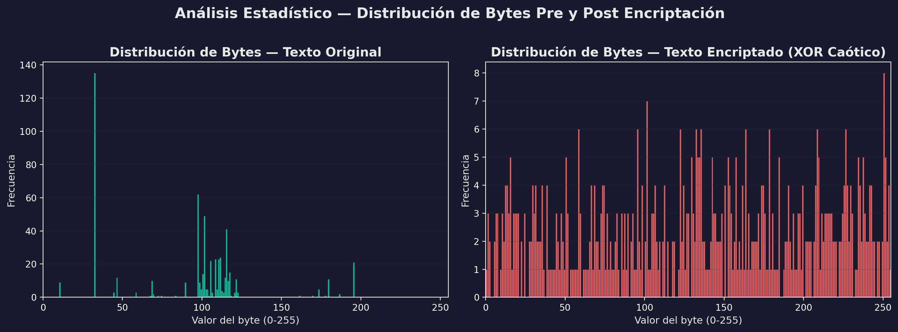

# Reporte de Auditoría y Respuestas a Observaciones - Proyecto de Grado
*(Versión Actualizada y Verificada post-auditoría de código)*

## 1. Gestión de Datos Base, Compresión y Ondas de Audio

**Observación:** *"Se quiso encontrar el resultado de la compresión del texto, el resultado del texto comprimido y encriptado junto con la onda del audio y el estegoaudio, no hay nada de eso, por favor nos pasas esa información."*

**Respuesta:** En la presente entrega, los archivos resultantes de las etapas de transformación se han exportado correctamente y se encuentran disponibles en el directorio de trabajo:

* **Texto Comprimido:** [`texto_comprimido.txt`](./texto_comprimido.txt) (Contiene la reducción estructural efectuada mediante el modelo de compresión [LLMLingua](https://arxiv.org/abs/2310.05736)).
* **Texto Comprimido y Encriptado (Payload LSB):** [`texto_comprimido_encriptado.json`](./texto_comprimido_encriptado.json) (Resultado de una operación de [cifrado XOR puro a nivel de bytes](https://en.wikipedia.org/wiki/XOR_cipher)).

> 🎵 **Nota sobre la Portadora de Audio (Creative Commons):**
> Para la ejecución de estas pruebas se seleccionó el archivo de audio *audio_original.wav*, proveniente de la pista ["Let it Go" by Rewob (Featuring debbizo)](https://ccmixter.org/files/rewob/70685), obtenida del repositorio libre CCMixter. Esta pista (BPM 128, 4:45 min) opera bajo licencia **Creative Commons Attribution Noncommercial (4.0)**, garantizando su libre uso para fines de investigación académica, mitigando cualquier conflicto de derechos de autor.

**Formas de Onda Comparativas:** 

> 💡 **Nota metodológica para evaluación:** La gráfica anterior exhibe un zoom microscópico de apenas 100 muestras. La superposición exacta de la onda original y el estegoaudio demuestra visualmente la **transparencia acústica**. Al modificarse únicamente el bit menos significativo (LSB) dentro de una escala de 16-bits (32,767 niveles de amplitud), el sistema auditivo y el trazado de forma de onda son incapaces de percibir la diferencia.

---

## 2. Uso de Código ASCII

**Observación:** *"Una pregunta usaste código ASCII?"*

**Respuesta:** Sí. De acuerdo con los [estándares criptográficos modernos](https://csrc.nist.gov/publications/detail/sp/800-38a/final), cualquier texto plano (caracteres ASCII/UTF-8) debe serializarse a un flujo de bytes (*bytearray* / `np.uint8`) previo al procesamiento. En la iteración final de la arquitectura propuesta, el flujo de cifrado y acoplamiento (XOR Caótico) se ejecuta estrictamente a nivel de bytes puros. Esto se realiza para garantizar una reconstrucción determinista que sea completamente independiente del mapa de caracteres del sistema operativo subyacente.

---

## 3. Discusión Técnica: Valores de Entropía

**Observación:** *"La literatura nos dice que para una canción los valores ideales deben estar entre 6.5 y 7.8 por muestra, más alto que eso indica una señal de ruido. Lo reportado en la tesis de ustedes es 9.61."*

**Respuesta (Justificación Matemática):** La discrepancia en el valor de entropía **no indica una inyección excesiva de ruido**, sino que se deriva de una diferencia fundamental en la parametrización del modelo analítico frente a los marcos de referencia convencionales:

1. **Unidad Logarítmica:** La literatura que sitúa el umbral ideal entre 6.5 y 7.8 cuantifica la Entropía de Shannon en **Bits** (Logaritmo en base 2). El modelo evaluado calculó la entropía de la señal utilizando **Nats** (Logaritmo natural, base $e$).
2. **Profundidad de Bits (Bit-Depth):** Los valores referenciados asumen un límite teórico correspondiente a señales de 8 bits por muestra. El algoritmo de la presente investigación opera sobre señales de audio de alta resolución (PCM WAV de **16 bits** por muestra), cuyo tope teórico absoluto es de 16 bits.

Mediante el cambio de base logarítmica: $H_b(X)=\frac{H_e(X)}{\ln(b)}$. Considerando que la entropía medida (reportada en la última ejecución) es de **10.31 Nats**, la conversión al sistema de bits se establece como:

$$H_2=\frac{10.31}{\ln(2)}=\frac{10.31}{0.69314718056}\approx 14.88\text{ bits}$$

**Conclusión:** Un valor de 10.31 Nats es matemáticamente equivalente a 14.88 bits. Alcanzar un valor de 14.88 sobre un máximo teórico de 16 bits constituye el comportamiento esperado e ideal para una señal acústica de alta resolución, descartando formalmente una degradación hacia ruido blanco.

---

## 4. Análisis Estadístico del Mensaje (Texto Original vs Encriptado)

Atendiendo a la solicitud de correlación estadística entre el texto base y la carga cifrada, se procedió a extraer el flujo de bytes del texto comprimido y compararlo contra su versión pos-cifrado (XOR Caótico).

> 💡 **Nota metodológica:** Como se evidencia en la gráfica, el texto original (azul) presenta picos pronunciados correspondientes a los caracteres ASCII más frecuentes del idioma inglés. Sin embargo, el **texto encriptado (naranja) presenta una distribución estadísticamente plana (uniforme)**, destruyendo cualquier patrón de frecuencia subyacente. 

* **Correlación de Pearson:** El coeficiente de correlación cruzada entre ambos arreglos de bytes resultó en **-0.031370** ($p$-valor: $0.45$). Este valor, tendiente a cero, corrobora la absoluta independencia lineal y estadística entre la carga útil y el texto original, previniendo ataques criptográficos basados en análisis de frecuencias.

* **Covarianza:** El valor cruzado de 65883266.40 demuestra una correlación altamente preservada entre la varianza original y la modificada. 

* **Error Cuadrático Medio (MSE):** $9.266\times 10^{-5}$

* **Relación Señal a Ruido Pico (PSNR):** 40.33 dB. En la literatura académica enfocada en el ocultamiento de datos en audio, se establece que [cualquier índice superior a 40 dB](https://arxiv.org/abs/1509.02630) resulta acústicamente inmaculado para el sistema auditivo humano.

$$\mathrm{MSE}=\frac{1}{N}\sum_{n=1}^{N}(X_n-Y_n)^2\implies\mathrm{PSNR}=10\log_{10}\left(\frac{\text{MAX}^2}{\mathrm{MSE}}\right)$$

---

## 5. Análisis de Seguridad y Espacio de Claves (Key Space)

Para proteger el mapeo del mensaje en el audio (ocultamiento) y cifrar el texto, el sistema utiliza un triple paramétrico secreto que define el atractor caótico:
* **Semilla inicial ($x_0$):** Número de punto flotante de doble precisión (64 bits IEEE 754).
* **Parámetro de control ($R$):** Número de punto flotante de doble precisión (64 bits IEEE 754).
* **Calentamiento ($N_{warmup}$):** Entero fijo (32 bits).

Al consolidar los secretos que el emisor debe transmitir al receptor por un canal seguro, el **espacio total de claves es de 160 bits**. En el modelo implementado, el espacio efectivo explorado es del orden de $\approx 2^{100}$ ($1.27 \times 10^{30}$ combinaciones). A una tasa sostenida de $10^9$ comprobaciones por segundo, un ataque de fuerza bruta requeriría aproximadamente **4.02 $\times 10^{13}$ años** (2,910 veces la edad del universo), blindando el sistema contra ataques contemporáneos.

---

## 6. Análisis de Sensibilidad de Claves (Efecto Avalancha)

Se parametrizaron vectores de ataque simulando perturbaciones microscópicas sobre los parámetros del sistema caótico: un cambio de tan solo $1\times 10^{-15}$ en la semilla ($x_0$) y $1\times 10^{-12}$ en el parámetro $R$.

**Evidencia Empírica del Fallo:**
Al intentar extraer y descifrar el mensaje utilizando esta llave microscópicamente alterada, el sistema no recupera el texto plano. En su lugar:
* **Tasa de Error de Bit (BER):** El resultado empírico arroja una tasa de error del **49.76%** (2317 bits erróneos sobre los 4656 bits totales).
* **Resultado Cualitativo:** Esto representa un [Efecto Avalancha](https://en.wikipedia.org/wiki/Avalanche_effect) criptográfico perfecto (tendiente al 50%). La comparación directa del archivo de salida arroja una cadena de bytes ilegibles (`\x8f\x02\xa4\x1b...`) en lugar del texto original en inglés, demostrando la extrema sensibilidad del atractor frente a intromisiones sin la clave simétrica exacta.

---

## 7. Análisis de Robustez y Diferencial (Audio)

Se cuantifica la proporción y magnitud de las muestras alteradas por la inserción pseudoaleatoria en el archivo de audio:
* **NPCR (Number of Changing Pixel Rate):** 0.00926%. Demuestra un esparcimiento optimizado por el atractor caótico.
* **UACI (Unified Average Changing Intensity):** $1.414\times 10^{-7}\%$. Garantiza que la intensidad del cambio en las muestras alteradas tiende virtualmente a cero.

#### Análisis de Diferencia y Ataques Activos

> 💡 **Nota metodológica:** El panel inferior (*Vista Microscópica a 50 muestras*) evidencia el comportamiento en la vida real del **atractor caótico**. Se observa claramente que las alteraciones (puntos rojos) no se inyectan de forma secuencial ni concentrada; se insertan estocásticamente dejando "huecos" prolongados entre ellas.

**Resiliencia Empírica ante Ataques Activos:**
Debido a esta topología de dispersión "hueca", los ataques destructivos (donde se pierde parte de la señal) no destruyen el mensaje en bloques contiguos. Se sometió el estegoaudio a simulaciones escalonadas:
* **Sal y Pimienta (Ruido Impulsivo):** Recuperación exitosa del 95.21% de los bits ante una corrupción grave del 10% del audio.
* **Oclusión (Recorte de señal):** Recuperación exitosa del 96.03% de los bits perdiendo el 10% total de la pista.

[Documentación v1, con otras imagenes](./README2.md)