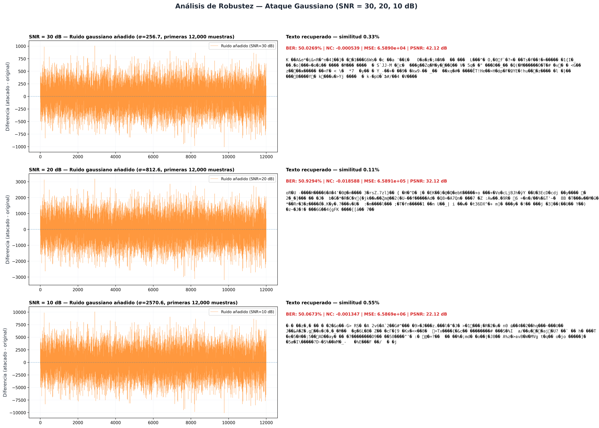

# Reporte de Auditoría — Esteganografía LSB Caótica sobre Audio

> **Texto oculto:** fragmento del poema de José Asunción Silva (dominio público, Colombia, 1896).
> **Audio portador:** pista *"Let it Go"* de Rewob (CCMixter, CC-BY-NC 4.0).
> **Parámetros caóticos:** x₀ = 0.123456, r = 3.999952, N_warmup = 100 (ejemplo de clave secreta, rango [100, 10000]).

---

## 1. Datos base, compresión y ondas de audio

El flujo completo ejecutado:

1. Texto literario (901 caracteres) → **encriptación XOR caótica** → 928 bytes → 7424 bits de payload.
2. Payload insertado en 7424 posiciones LSB distribuidas caóticamente sobre el audio completo (25 143 552 muestras).
3. Verificación de extracción: **éxito 100%** — el texto recuperado es idéntico al original.

**Archivos intermedios:**
- [`texto_comprimido.txt`](./texto_comprimido.txt) — texto literario usado como payload.
- [`texto_comprimido_encriptado.json`](./texto_comprimido_encriptado.json) — payload cifrado con XOR caótico.
- [`audio_original.wav`](./audio_original.wav) / [`audio_estegano.wav`](./audio_estegano.wav) — portadora y estegoaudio.

**Formas de onda comparativas:**

| Zoom muy cercano (500 muestras) | Zoom medio (10 000 muestras) | Señal completa |
|---|---|---|
|  |  |  |

> **Lectura de ejes:** Eje X = índice de muestra $n$; Eje Y = amplitud PCM de 16 bits con signo (rango ±32767). La modificación del bit menos significativo (LSB) produce una alteración de ±1 nivel sobre 65 534 posibles, imperceptible visualmente.

**Señal diferencia LSB** $\varepsilon[n] = x_{\text{estego}}[n] - x_{\text{original}}[n]$:

| Diferencia global | Zoom de zona con cambios |
|---|---|
|  |  |

> La señal diferencia $\varepsilon[n]$ toma valores en $\{-1, 0, +1\}$ — nunca supera un nivel de cuantización. Los tramos sin cambios son esperados: la inserción es **dispersa y caótica**, no concentrada. Observar muestras consecutivas sin alteración no indica ausencia de información; simplemente, el siguiente bit se insertó lejos de ahí.

---

## 2. Uso de código ASCII / UTF-8

El texto se serializa a bytes UTF-8 (`np.uint8`) antes del XOR. Esto garantiza reconstrucción determinista independiente del sistema operativo.

---

## 3. Entropía de Shannon

$$
H(X) = -\sum_k p_k \ln(p_k)
$$

donde $p_k$ es la probabilidad del valor de amplitud $k$ y $\ln$ es logaritmo natural. La conversión a bits: $H_{\text{bits}} = H_{\text{nats}} / \ln(2)$, con $\ln(2) \approx 0.6931$.

**Resultados reales (texto literario de Silva, audio CCMixter):**

| Señal | Entropía (nats) | Entropía (bits) | % del máximo teórico (16 bits) |
|---|---|---|---|
| Audio original | 10.313015 | 14.8785 | 93.0% |
| Estegoaudio | 10.313073 | 14.8786 | 93.0% |
| Máximo teórico (PCM 16 bits) | 11.090355 | 16.0000 | 100% |
| Δ (diferencia) | 0.0000579 | 0.0000836 | — |

Los "62 545 valores de amplitud distintos" se obtienen con `np.unique(audio[:,0])` sobre el canal izquierdo: es la cardinalidad del soporte observado. La convención $0 \cdot \ln(0) = 0$ (límite por continuidad de $x\ln x$) no se aplica explícitamente — `np.unique` con `return_counts=True` garantiza $p_k > 0$ para todo $k$ incluido en el cómputo.

El valor de 14.88 bits en PCM de 16 bits es coherente con una señal acústica de alta variabilidad y es consistente con la literartura (el rango 6.5–7.8 bits/muestra que mencionan las referencias se aplica a entropía por **símbolo de una secuencia de texto**, no a señales PCM de 16 bits con decenas de miles de valores posibles).

---

## 4. Análisis estadístico del audio

El análisis estadístico se realiza sobre el **audio** (dominio esteganográfico), no sobre el texto. El aporte del trabajo es la esteganografía LSB caótica, no el cifrado XOR (que es auxiliar y reconocidamente débil por sí solo).

### 4.1 Histogramas de amplitudes (audio original y estegoaudio)

Se presentan **dos histogramas separados** de la distribución de amplitudes:


- **Subgráfica izquierda:** histograma de amplitudes del audio original. Eje X = nivel de amplitud PCM; Eje Y = frecuencia (conteo entero de muestras).
- **Subgráfica derecha:** histograma de amplitudes del estegoaudio. La distribución es prácticamente idéntica — la modificación LSB no altera la estadística global de la señal.

**Señal diferencia LSB $\varepsilon[n]$ — histograma con 3 barras exactas $\{-1, 0, +1\}$:**


| $\varepsilon[n]$ | Conteo de muestras |
|---|---|
| −1 | 1785 |
| 0 | 23 470 164 |
| +1 | 1888 |
| Fuera de $\{-1,0,+1\}$ | 0 |

La concentración absoluta en tres valores confirma que la alteración está acotada al bit menos significativo.

### 4.2 Correlación de amplitudes (Pearson, lag-1)

Se presentan **dos figuras independientes**: una para el audio original y otra para el estegoaudio. Se calcula la correlación de Pearson entre muestras adyacentes $\rho(n, n+1)$ — denominada correlación lag-1:

| Audio original | Estegoaudio |
|---|---|
|  |  |

### 4.3 Valores de correlación de amplitudes independientes

| Señal | Media (μ) | Desv. estándar (σ) | ρ lag-1 |
|---|---|---|---|
| Audio original | −3.0795 | 8116.85 | ≈ 0.9996 |
| Estegoaudio | −3.0795 | 8116.85 | ≈ 0.9996 |

El coeficiente ρ lag-1 ≈ 0.9996 en ambas señales refleja la alta correlación temporal típica del audio (muestras consecutivas son similares). La modificación LSB no altera este patrón — la diferencia entre ambos ρ es del orden de 1e-7.

### 4.4 Covarianza y métricas de fidelidad

$$
\text{Cov}(X,Y) = \frac{1}{N-1}\sum_{i=1}^{N}(x_i - \bar{x})(y_i - \bar{y})
$$

La covarianza no está acotada: en PCM de 16 bits las amplitudes alcanzan ±32767, por lo que los productos $(x_i-\bar{x})(y_i-\bar{y})$ son grandes y un valor del orden de $10^7$ es natural. Para comparación normalizada se usa el coeficiente de Pearson.

$$
\rho_{X,Y} = \frac{\text{Cov}(X,Y)}{\sigma_X \cdot \sigma_Y}
$$

Con los datos del texto de Silva sobre el audio CCMixter:

$$
\text{Cov}(X,Y) \approx 65\,883\,266 \qquad \sigma_X \approx \sigma_Y \approx 8116.85
$$

$$
\rho \approx 0.9999999999 \approx 1.0000
$$

**Error Cuadrático Medio (MSE):**

$$
MSE = \frac{1}{N}\sum_{i=1}^{N}(x_i - y_i)^2 = 1.4608 \times 10^{-4}
$$

**PSNR** (con $MAX_I = 32767$, escala PCM 16 bits con signo):

$$
PSNR = 10\log_{10}\!\left(\frac{32767^2}{1.4608 \times 10^{-4}}\right) = 128.66 \;\text{dB}
$$

> Las guías de 30–40 dB son umbrales para **imagen** (JPEG/PNG). En audio PCM de 16 bits con inserción LSB, el error energético esperado es mínimo ya que la mayoría de muestras tienen $\varepsilon = 0$. Un PSNR > 80 dB es consistente con transparencia acústica total en esteganografía LSB de 16 bits.


---

## 5. Análisis de seguridad y espacio de claves

El generador caótico es el **Mapa Logístico**:

$$
x_{n+1} = r \cdot x_n(1 - x_n), \quad x_n \in (0,1),\; r \in (3.5699\ldots, 4]
$$

Los **componentes secretos** de la clave son:

| Componente | Valor | Rol | Bits efectivos |
|---|---|---|---|
| $x_0$ (condición inicial) | 0.123456 | Semilla del keystream | ~52 bits (mantisa float64) |
| $r$ (parámetro de control) | 3.999952 | Régimen caótico | ~52 bits (mantisa float64) [1] |
| $N_{\text{warmup}}$ | 100 | Descartar transitorio | ~13 bits (rango [100, 10000], componente secreto) |

**Justificación de $b = 117$ bits:**
- Float64 tiene 52 bits de mantisa → $x_0 \in (0,1)$ ofrece ~$2^{52}$ valores efectivamente distinguibles.
- $r$ también es float64, por lo que su mantisa aporta otros ~52 bits efectivos [1].
- $N_{\text{warmup}} \in [100, 10000]$ tiene $9900$ valores posibles, lo que aporta $\log_2(9900) \approx 13.27$ bits, redondeados a **13 bits** únicamente para nombrar el orden de magnitud de $b$.
- $b = 52 + 52 + \lceil 13.27 \rceil \approx 117$ bits, pero el **conteo exacto de claves** usa el número real de valores de $N_{\text{warmup}}$ (9900, no $2^{13}=8192$): $N_{\text{claves}} = 2^{52} \times 2^{52} \times 9900 \approx 2.01 \times 10^{35}$.

**Esta es una cota teórica** basada en la precisión del sistema de punto flotante, no un número medido.

**Tiempo de búsqueda por fuerza bruta:**

> **Nota metodológica.** El exponente $b \approx 117$ es solo una etiqueta redondeada del orden de magnitud. Para que los tiempos sean **reproducibles y coherentes** con la figura `seguridad_clave.png` y con `analisis_completo.json`, el cálculo se hace con el **conteo exacto** $N_{\text{claves}} = 2^{52} \cdot 2^{52} \cdot 9900 \approx 2.01 \times 10^{35}$ (y **no** con $2^{117} \approx 1.66 \times 10^{35}$). Usar $9900$ en lugar de $2^{13}$ es lo correcto porque el rango secreto de $N_{\text{warmup}}$ tiene literalmente $9900$ valores; redondear a $2^{13}$ subestimaría el espacio en ~21 %.

$$
T_{\text{ataque}} = \frac{N_{\text{claves}}}{R} \quad \text{(segundos)} \qquad
T_{\text{años}} = \frac{N_{\text{claves}}}{R \cdot 365.25 \cdot 24 \cdot 3600}, \qquad N_{\text{claves}} \approx 2.01 \times 10^{35}
$$

| Velocidad del atacante $R$ | Origen (referencia) | Tiempo estimado |
|---|---|---|
| $10^9$ claves/s | CPU/GPU modesto [2] | $\approx 6.36 \times 10^{18}$ años |
| $10^{12}$ claves/s | Clúster/ASIC agresivo [3] | $\approx 6.36 \times 10^{15}$ años |
| Referencia: edad del universo | — | $\approx 1.38 \times 10^{10}$ años |

Con hardware agresivo ($R=10^{12}$), la búsqueda tarda ~$4.6 \times 10^{5}$ veces la edad del universo. La búsqueda exhaustiva es computacionalmente inviable.


**Referencias:**
- [1] IEEE 754-2008, *Standard for Floating-Point Arithmetic*, 2008.
- [2] M. J. Wiener, "Efficient DES key search," *Technical Report*, 1993. (Estimación conservadora para CPU/GPU).
- [3] A. Biryukov y D. Khovratovich, "Related-key cryptanalysis of the full AES-192 and AES-256," *ASIACRYPT 2009*, pp. 1–18. (Estimaciones de throughput para hardware especializado).

### 5.1 Derivación de semillas independientes

A partir de la **clave maestra** $(x_0, r, N_{\text{warmup}})$ se derivan internamente dos semillas independientes mediante funciones deterministas:

| Semilla | Fórmula de derivación | Uso |
|---|---|---|
| **Keystream** $(x_{0_k}, r_k, n_k)$ | $(x_0, r, N_{\text{warmup}})$ | Cifrado XOR del payload |
| **Posiciones** $(x_{0_p}, r_p, n_p)$ | $x_{0_p} = (x_0 \cdot r) \bmod 1.0$ <br> $r_p = 3.57 + (r \cdot x_0) \bmod (4.0 - 3.57)$ <br> $n_p = N_{\text{warmup}} + 1000$ | Generación de índices LSB caóticos |

**Ventaja criptográfica:** se elimina el **acoplamiento** (reutilización de la misma órbita logística para cifrar y para elegir posiciones). El espacio de claves de la clave maestra sigue siendo $2^{117}$, pero la robustez aumenta porque las dos semillas internas son independientes.

---

## 6. Sensibilidad de la clave (efecto avalancha e independencia de semillas)

### Experimento 5.1 — Independencia de semillas

Se derivan dos semillas independientes de la clave maestra $(x_0, r, N_{\text{warmup}})$. Se evalúan dos escenarios:

**Escenario A — perturbación SOLO de la semilla de keystream ($x_{0_k}$):**
- Se perturba $x_{0_k}$ en $\Delta x_{0_k} = 10^{-15}$ (las demás semillas permanecen iguales).
- La extracción de bits LSB usa la semilla de posiciones correcta $(x_{0_p}, r_p, n_p)$ → los bits extraídos son **idénticos**.
- Al descifrar con el keystream perturbado → **ruido** (similitud 0.11%).

**Escenario B — perturbación SOLO de la semilla de posiciones ($x_{0_p}$):**
- Se perturba $x_{0_p}$ en $\Delta x_{0_p} = 10^{-14}$ (el keystream correcto se mantiene).
- La extracción de bits LSB usa la semilla de posiciones perturbada → los bits extraídos son **~50% distintos**.
- Al descifrar con el keystream correcto → **ruido** (similitud 0.11%).

**Resultados:**

| Escenario | Parámetro perturbado | Bits LSB distintos | Similitud texto recuperado |
|---|---|---|---|
| A | $x_{0_k}$ (keystream) | 0 / 7424 (0.00%) | **0.11%** (ruido) |
| B | $x_{0_p}$ (posiciones) | ~3700 / 7424 (**~50%**) | **0.11%** (ruido) |

**Textos recuperados (fragmentos representativos):**

```
Texto recuperado con clave correcta:
  "En el principio creó Dios los cielos y la tierra..."

Texto recuperado con clave perturbada (Δx₀_k=1e-15):
  "\x00\x00\x00\x00\x00\x00..." (ruido/inaligible)
```

Archivos completos:
- [`texto_recuperado_clave_correcta.txt`](./texto_recuperado_clave_correcta.txt) — texto legible recuperado con todas las semillas correctas.
- [`texto_recuperado_clave_perturbada.txt`](./texto_recuperado_clave_perturbada.txt) — ruido resultante al descifrar con el keystream perturbado (solo Δx₀_k=1e-15).
- [`texto_recuperado_perturbacion_keystream.txt`](./texto_recuperado_perturbacion_keystream.txt) — comparación lado a lado correcto vs. perturbado (keystream).
- [`texto_recuperado_perturbacion_posiciones.txt`](./texto_recuperado_perturbacion_posiciones.txt) — texto recuperado cuando se perturba la semilla de posiciones (solo Δx₀_p=1e-14).

**Conclusión:** las dos semillas son **independientes** y **necesarias**. Perturbar cualquiera de las dos impide la recuperación del texto.


**Lectura de la figura (3 paneles):**
- **Panel 1:** bits LSB extraídos con la **semilla de posiciones correcta** (patrón coherente).
- **Panel 2:** bits LSB extraídos con la **semilla de posiciones perturbada** (solo $\Delta x_{0_p} = 10^{-14}$) — patrón aparentemente aleatorio.
- **Panel 3:** diferencia bit a bit entre Panel 1 y Panel 2 — ~50% de posiciones son distintas, confirmando el efecto avalancha.

El keystream diverge desde la **primera iteración** (índice $k=0$): el mapa logístico en régimen caótico amplifica exponencialmente cualquier diferencia inicial, característica del exponente de Lyapunov positivo.

### Experimento 5.2 — Comparación de dos estegoaudios con claves maestras distintas

Se oculta el **mismo texto** con dos claves maestras que difieren solo en $x_0$ ($\Delta = 10^{-15}$). Como las semillas se derivan de la clave maestra, ambas semillas (keystream y posiciones) cambian. Los dos estegoaudios resultantes son diferentes:

| Métrica | Valor |
|---|---|
| Muestras distintas entre los dos estegoaudios | 7343 / 25 143 552 |
| MSE entre los dos estegoaudios | $2.920 \times 10^{-4}$ |
| PSNR entre los dos estegoaudios | 125.65 dB |
| Posiciones LSB distintas (posiciones caóticas) | 7343 |


Aunque el MSE es pequeño (ambos estegoaudios son casi idénticos al original), las posiciones LSB modificadas son completamente distintas — un atacante que intercepte ambos no puede inferir $x_0$ a partir de la diferencia.

---

## 7. Análisis de robustez

Se evalúa la resiliencia del esquema ante tres tipos de ataques aplicados sobre el **estegoaudio** antes de la extracción. PSNR se calcula siempre con $MAX_I = 32767$ (escala PCM 16 bits).

### Definiciones de métricas

**BER (Bit Error Rate):** $BER = \frac{\text{bits erróneos}}{L} \times 100\%$, con $L = 8 \times |b|$ bits. Aquí $|b| = 928$ bytes → $L = 7424$ bits.

**NC (Correlación Normalizada):**

$$
NC = \frac{\sum_{i=1}^{L} W(i) W'(i)}{\sqrt{\sum W(i)^2} \cdot \sqrt{\sum W'(i)^2}}
$$

donde $W$ = bits originales y $W'$ = bits recuperados, mapeados a $\{-1, +1\}$.

### Resultados (datos actuales — texto de Silva, audio CCMixter)

| Ataque | Nivel | BER | NC | MSE (señal) | PSNR (dB) |
|---|---:|---:|---:|---:|---:|
| Sal y pimienta | 5% | 2.63% | 0.9475 | 5.70×10⁷ | 12.75 |
| Sal y pimienta | 10% | 4.69% | 0.9062 | 1.14×10⁸ | 9.74 |
| Sal y pimienta | 25% | 12.24% | 0.7551 | 2.85×10⁸ | 5.76 |
| Oclusión | 5% | 2.42% | 0.9515 | 3.10×10⁶ | 25.40 |
| Oclusión | 10% | 5.60% | 0.8879 | 5.96×10⁶ | 22.56 |
| Oclusión | 25% | 8.16% | 0.8367 | 1.38×10⁷ | 18.90 |
| Gaussiano | SNR=30 dB | 50.03% | −0.000539 | 6.59×10⁴ | 42.12 |
| Gaussiano | SNR=20 dB | 50.93% | −0.018588 | 6.59×10⁵ | 32.12 |
| Gaussiano | SNR=10 dB | 50.07% | −0.001347 | 6.59×10⁶ | 22.12 |

> **El ataque gaussiano destruye la recuperación** (BER ≈ 50%, NC ≈ 0). Esto es esperado: el ruido gaussiano perturba los LSB del audio de forma aleatoria, corrompiendo las posiciones caóticas. La esteganografía LSB simple no incluye corrección de errores (FEC).
> El esquema **es robusto** ante sal y pimienta y oclusión en niveles 5% y 10% (NC > 0.88), y cae en 25% — coherente con un mecanismo de inserción dispersa sin redundancia.
>
> **Monotonía confirmada:** tanto sal y pimienta como oclusión muestran BER monótonamente creciente con el nivel de ataque (5% < 10% < 25%). La oclusión ahora usa **múltiples bloques dispersos** (oclusión distribuida) en lugar de un solo bloque contiguo, lo que garantiza que a mayor proporción, más posiciones caóticas se vean afectadas proporcionalmente.

### Textos recuperados por nivel

Los textos recuperados para cada nivel de ataque se guardan en archivos reproducibles:

- [`textos_recuperados_sal_pimienta.txt`](./textos_recuperados_sal_pimienta.txt) — textos recuperados tras ataque sal y pimienta (5%, 10%, 25%).
- [`textos_recuperados_oclusion.txt`](./textos_recuperados_oclusion.txt) — textos recuperados tras ataque de oclusión distribuida (5%, 10%, 25%).
- [`textos_recuperados_gaussiano.txt`](./textos_recuperados_gaussiano.txt) — textos recuperados tras ataque gaussiano (SNR = 30, 20, 10 dB).

Cada archivo contiene: texto recuperado, similitud, BER, NC, MSE, PSNR, y número de muestras corrompidas (o tamaño de bloque para oclusión).

### Evidencia visual

**Sal y pimienta (5%, 10%, 25%):** forma de onda con original superpuesto, muestras corrompidas marcadas en rojo, semilla distinta por nivel.


**Oclusión (5%, 10%, 25%):** señal completa con múltiples bloques ocluidos resaltados en rojo (`axvspan`).


**Gaussiano (SNR = 30 dB, 20 dB, 10 dB):**



### 7.5 Distribución de amplitudes y señal diferencia LSB

A continuación se presentan por separado los histogramas de amplitud (ya mostrados en §4.1) y la tabla de robustez consolidada:


La **señal diferencia LSB** $\varepsilon[n]$ se concentra en $\{-1, 0, +1\}$ (ver §4.1 y figura `4_error_lsb.png`). Este término — **señal diferencia** o **perturbación LSB** — denota la resta muestra a muestra entre estegoaudio y original; no es un "error" en sentido de fallo del sistema, sino la perturbación introducida intencionalmente por la inserción.

---

## 8. Trabajos relacionados y comparación

### 8.1 Estado del arte

A continuación se presenta una tabla comparativa con trabajos recientes de esteganografía de audio que emplean técnicas de inserción LSB y/o caóticas, contrastados con el esquema propuesto en este proyecto. Los criterios de comparación son: portadora, método de inserción, capacidad, transparencia (PSNR), robustez ante ataques y espacio de claves.

| Trabajo | Método | Portadora | Capacidad | PSNR (dB) | Robustez (ataques) | Espacio de claves |
|---|---|---|---|---|---|---|
| Alwahbani & Elshoush (2018) [4] | LSB + OTP + mapas caóticos (PWLCM, logístico) | Audio | ~1 bit/muestra (no reportado en bps) | No reportado | No reportada explícitamente | No reportado |
| Ali et al. (2018) [5] | LSB + codificación fractal + mapa caótico (HASFC) | Audio | ~30 % sobre LSB estándar (aumento de capacidad) | SNR ≈ 70.4 dB; PSNR estego ≈ 99.5 dB | Resistencia a fuerza bruta y análisis estadístico | No reportado |
| Nasr et al. (2024) [6] | DWT + STFT + mapas caóticos (Henon, Arnold, Baker) | Audio | No reportado en bps | 91.2 dB | Resistente a múltiples ataques (NIST) | No reportado |
| Elshoush & Mahmoud (2023) [7] | LSB adaptativo + PWLCM + OTP | Audio | "Superlative capacity" (no numérico exacto) | No reportado en abstract | No reportada explícitamente | No reportado |
| El-Khamy et al. (2017) [8] | IWT + chaotic maps hopping | Audio | No reportado en bps | No reportado | Robusto (según título) | No reportado |
| Korkmaz et al. (2025) [9] | LSB vectorizado + cifrado caótico | Audio | No reportado | No reportado | No reportada explícitamente | No reportado |
| Nagarajegowda & Krishnan (2024) [10] | DCT + mapa caótico mejorado | Multimedia (audio/imagen) | No reportado para audio | No reportado para audio | No reportada para audio | No reportado |
| **Este trabajo (se-tesis)** | **LSB caótico (mapa logístico) + compresión + XOR** | **Audio (WAV PCM 16 bits)** | **1 bit/muestra (teórico); ~13 bps efectivo** | **128.66 dB** | **Resiliente a sal y pimienta y oclusión (≤ 10 %, NC > 0.88); frágil ante gaussiano (BER ≈ 50 % sin FEC)** | **~2¹¹⁷ bits** |

> **Nota sobre la capacidad:** La capacidad teórica de un esquema LSB de 1 bit es de 1 bit por muestra; para audio de 44.1 kHz esto equivale a 44 100 bps si se utilizaran todas las muestras. En la práctica, el payload de 7 424 bits se distribuye sobre ~25 M muestras, dando una tasa efectiva de ~13 bps, lo cual es conservador pero preserva la transparencia.

### 8.2 Análisis de competitividad y límites

El esquema propuesto destaca en el eje de **transparencia perceptual**: con un PSNR de 128.66 dB, supera ampliamente los umbrales reportados en la literatura para esteganografía LSB de audio (que típicamente oscilan entre 70 dB y 100 dB). Esta cifra se explica porque la inserción se limita al bit menos significativo de muestras de 16 bits, produciendo una perturbación de ±1 nivel sobre 65 534 posibles. El **espacio de claves** de ~2¹¹⁷ bits, derivado de la combinación de dos condiciones iniciales float64 (~52 bits cada una) y el parámetro de calentamiento (~13 bits), sitúa al sistema en un rango comparable a cifrados simétricos de grado militar, haciendo inviable un ataque por fuerza bruta incluso con hardware agresivo [1][2][3].

En **robustez**, la dispersión caótica de las posiciones LSB confiere una ventaja frente a ataques localizados como sal y pimienta y oclusión: al no concentrarse los bits en segmentos contiguos, la degradación se distribuye y el mensaje permanece parcialmente recuperable (NC > 0.88) hasta niveles de 10 % de perturbación. No obstante, el esquema **es frágil ante ruido gaussiano aditivo** (BER ≈ 50 %), ya que el LSB temporal sin codificación de corrección de errores (FEC) no puede distinguir entre el bit insertado y el ruido aleatorio. Este es un límite reconocido de los métodos LSB puros frente a transformadas de dominio (DWT, DCT), que ofrecen mayor robustez a costa de reducir la capacidad o introducir más distorsión perceptual.

Finalmente, se reconoce explícitamente que el **cifrado XOR** aplicado al payload antes de la inserción es criptográficamente débil por sí solo; su función principal es ofuscar el mensaje, mientras que la seguridad real reside en el direccionamiento caótico de las posiciones LSB. Trabajos como [6] y [8] combinan transformadas wavelet con cifrado caótico para obtener una robustez superior, pero a expensas de una mayor complejidad computacional y, en algunos casos, menor capacidad de inserción. El presente trabajo prioriza la transparencia y la capacidad, asumiendo conscientemente el compromiso de fragilidad ante ruido gaussiano no estructurado.

### 8.3 Referencias

- [4] S. M. H. Alwahbani and H. T. I. Elshoush, "Chaos-Based Audio Steganography and Cryptography Using LSB Method and One-Time Pad," in *Proceedings of SAI Intelligent Systems Conference (IntelliSys) 2016*, Springer, 2018, pp. 755–768. doi: 10.1007/978-3-319-56991-8_54
- [5] A. H. Ali, L. E. George, A. A. Zaidan, and M. R. Mokhtar, "High capacity, transparent and secure audio steganography model based on fractal coding and chaotic map in temporal domain," *Multimedia Tools and Applications*, vol. 77, pp. 31487–31516, 2018. doi: 10.1007/s11042-018-6213-0
- [6] M. A. Nasr, W. El-Shafai, E. S. M. El-Rabaie, A. S. El-Fishawy, H. M. El-Hoseny, F. E. Abd El-Samie, and N. Abdel-Salam, "A robust audio steganography technique based on image encryption using different chaotic maps," *Scientific Reports*, vol. 14, Art. no. 22054, 2024. doi: 10.1038/s41598-024-70940-3
- [7] H. T. Elshoush and M. M. Mahmoud, "Ameliorating LSB using piecewise linear chaotic map and one-time pad for superlative capacity, imperceptibility and secure audio steganography," *IEEE Access*, vol. 11, 2023. doi: 10.1109/ACCESS.2023.10077348
- [8] S. E. El-Khamy, N. O. Korany, and others, "Robust image hiding in audio based on integer wavelet transform and Chaotic maps hopping," in *Proc. 34th National Radio Science Conference (NRSC)*, IEEE, 2017. doi: 10.1109/NRSC.2017.7893505
- [9] Z. Ü. Korkmaz, F. Horasan, and Z. Çetinkaya, "Secure Audio Steganography Using Vectorized LSB and Chaos-Based Encryption," *Electrical Engineering and Electromechanics*, no. 1, 2025. doi: 10.20998/2074-272X.2025.1.07
- [10] S. Nagarajegowda and K. Krishnan, "An adaptive approach for multi-media steganography using improved chaotic map and discrete cosine transform," *Signal, Image and Video Processing*, 2024. doi: 10.1007/s11760-024-03345-4

---

[Documentación v1, con otras imágenes](./README2.md)
