# Reporte de Auditoría — Esteganografía LSB Caótica sobre Audio

> **Texto oculto:** fragmento del poema de José Asunción Silva (dominio público, Colombia, 1896).
> **Audio portador:** pista *"Let it Go"* de Rewob (CCMixter, CC-BY-NC 4.0).
> **Parámetros caóticos (clave maestra):** x₀ = 0.123456, r = 3.999952, N_warmup = 6173 (**componente secreto** de la clave, rango [100, 10000]).
> **Semillas independientes:** el cifrado (keystream) usa la clave maestra; las posiciones LSB usan una semilla derivada decorrelada (ver §5.1).

---

## 1. Datos base, compresión y ondas de audio

El flujo completo ejecutado:

1. Texto literario (901 caracteres) → **encriptación XOR caótica** → 928 bytes → 7424 bits de payload.
2. Payload insertado en 7424 posiciones LSB distribuidas caóticamente sobre el audio completo (25 143 552 muestras).
3. Verificación de extracción: **éxito 100%** — el texto recuperado es idéntico al original.

**Archivos intermedios:**
- [`texto_comprimido.txt`](./texto_comprimido.txt) — texto literario usado como payload.
- [`texto_comprimido_encriptado.json`](./texto_comprimido_encriptado.json) — payload cifrado con XOR caótico.
- [`audio_original.wav`](./audio_original.wav) / [`audio_estegano.wav`](./audio_estegano.wav) — portadora y estegoaudio.

**Formas de onda comparativas:**

| Zoom muy cercano (500 muestras) | Zoom medio (10 000 muestras) | Señal completa |
|---|---|---|
| 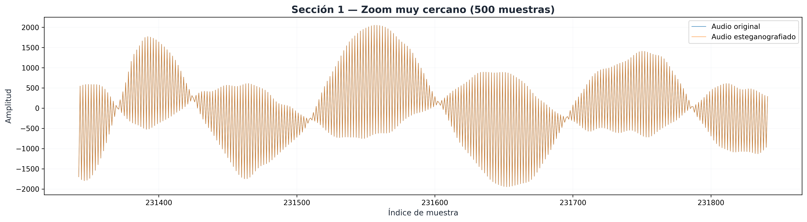 | 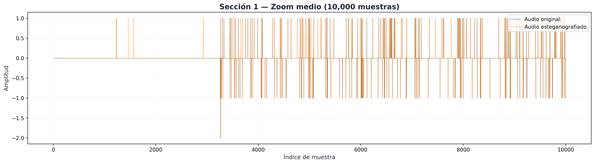 | 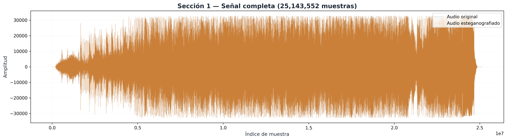 |

> **Lectura de ejes:** Eje X = índice de muestra $n$; Eje Y = amplitud PCM de 16 bits con signo (rango ±32767). La modificación del bit menos significativo (LSB) produce una alteración de ±1 nivel sobre 65 534 posibles, imperceptible visualmente.

**Señal diferencia LSB** $\varepsilon[n] = x_{\text{estego}}[n] - x_{\text{original}}[n]$:

| Diferencia global | Zoom de zona con cambios |
|---|---|
| 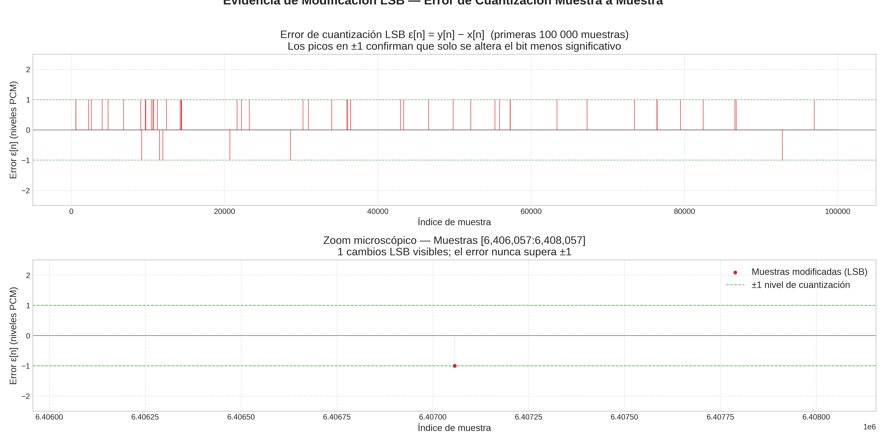 | 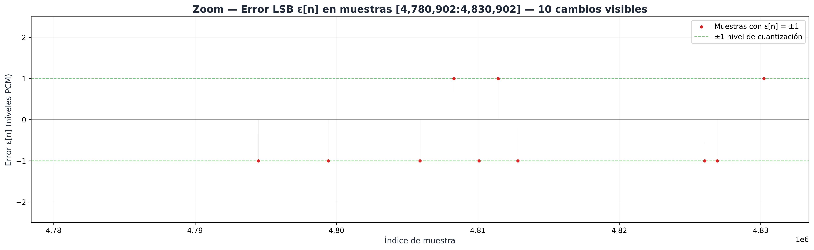 |

> La señal diferencia $\varepsilon[n]$ toma valores en $\{-1, 0, +1\}$ — nunca supera un nivel de cuantización. Los tramos sin cambios son esperados: la inserción es **dispersa y caótica**, no concentrada. Observar muestras consecutivas sin alteración no indica ausencia de información; simplemente, el siguiente bit se insertó lejos de ahí.

---

## 2. Uso de código ASCII / UTF-8

El texto se serializa a bytes UTF-8 (`np.uint8`) antes del XOR. Esto garantiza reconstrucción determinista independiente del sistema operativo.

---

## 3. Entropía de Shannon

$$
H(X) = -\sum_k p_k \ln(p_k)
$$

donde $p_k$ es la probabilidad del valor de amplitud $k$ y $\ln$ es logaritmo natural. La conversión a bits: $H_{\text{bits}} = H_{\text{nats}} / \ln(2)$, con $\ln(2) \approx 0.6931$.

**Resultados reales (texto literario de Silva, audio CCMixter):**

| Señal | Entropía (nats) | Entropía (bits) | % del máximo teórico (16 bits) |
|---|---|---|---|
| Audio original | 10.313015 | 14.8785 | 93.0% |
| Estegoaudio | 10.313073 | 14.8786 | 93.0% |
| Máximo teórico (PCM 16 bits) | 11.090355 | 16.0000 | 100% |
| Δ (diferencia) | 0.0000579 | 0.0000836 | — |

Los "62 545 valores de amplitud distintos" se obtienen con `np.unique(audio[:,0])` sobre el canal izquierdo: es la cardinalidad del soporte observado. La convención $0 \cdot \ln(0) = 0$ (límite por continuidad de $x\ln x$) no se aplica explícitamente — `np.unique` con `return_counts=True` garantiza $p_k > 0$ para todo $k$ incluido en el cómputo.

El valor de 14.88 bits en PCM de 16 bits es coherente con una señal acústica de alta variabilidad y es consistente con la literartura (el rango 6.5–7.8 bits/muestra que mencionan las referencias se aplica a entropía por **símbolo de una secuencia de texto**, no a señales PCM de 16 bits con decenas de miles de valores posibles).

---

## 4. Análisis estadístico del audio

El análisis estadístico se realiza sobre el **audio** (dominio esteganográfico), no sobre el texto. El aporte del trabajo es la esteganografía LSB caótica, no el cifrado XOR (que es auxiliar y reconocidamente débil por sí solo).

### 4.1 Histogramas de amplitudes (audio original y estegoaudio)

Se presentan **dos histogramas separados** de la distribución de amplitudes:

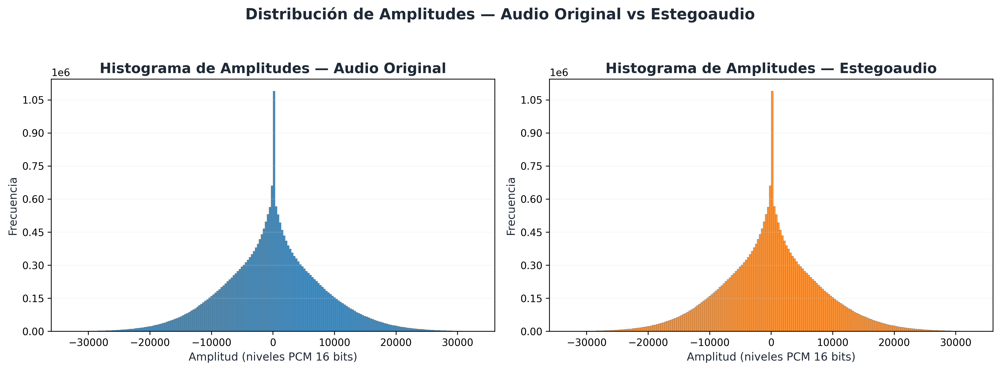

- **Subgráfica izquierda:** histograma de amplitudes del audio original. Eje X = nivel de amplitud PCM; Eje Y = frecuencia (conteo entero de muestras).
- **Subgráfica derecha:** histograma de amplitudes del estegoaudio. La distribución es prácticamente idéntica — la modificación LSB no altera la estadística global de la señal.

**Señal diferencia LSB $\varepsilon[n]$ — histograma con 3 barras exactas $\{-1, 0, +1\}$:**

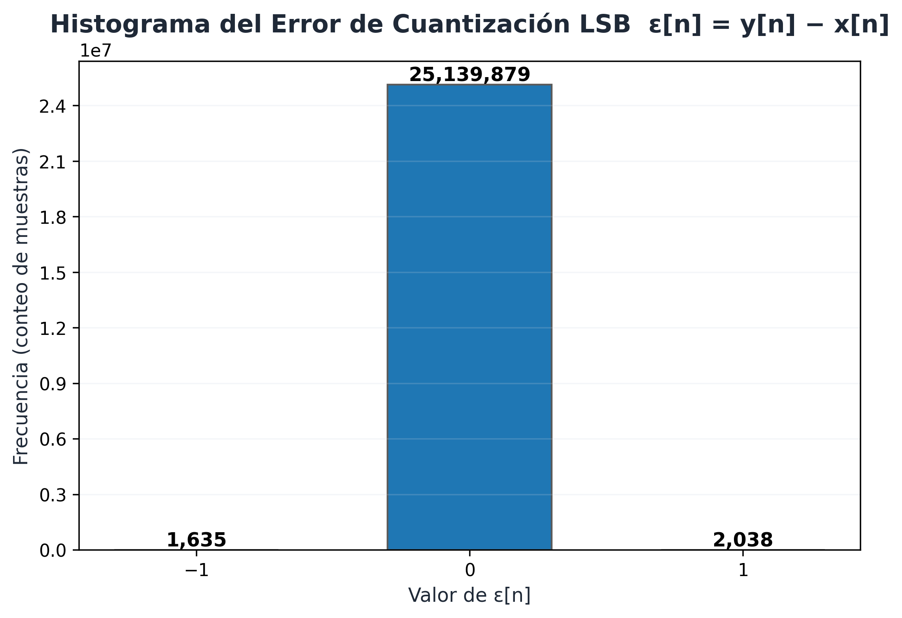

| $\varepsilon[n]$ | Conteo de muestras |
|---|---|
| −1 | 1710 |
| 0 | 25 139 825 |
| +1 | 2017 |
| Fuera de $\{-1,0,+1\}$ | 0 |

La concentración absoluta en tres valores confirma que la alteración está acotada al bit menos significativo.

### 4.2 Correlación de amplitudes (Pearson, lag-1)

Se presentan **dos figuras independientes**: una para el audio original y otra para el estegoaudio. Se calcula la correlación de Pearson entre muestras adyacentes $\rho(n, n+1)$ — denominada correlación lag-1:

| Audio original | Estegoaudio |
|---|---|
| 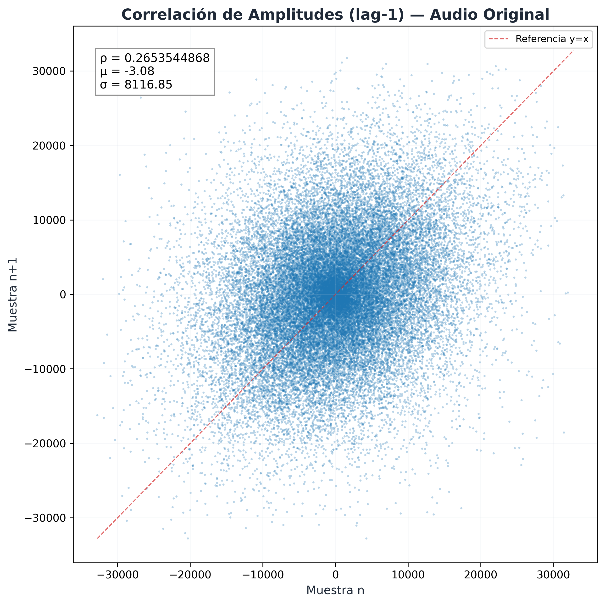 | 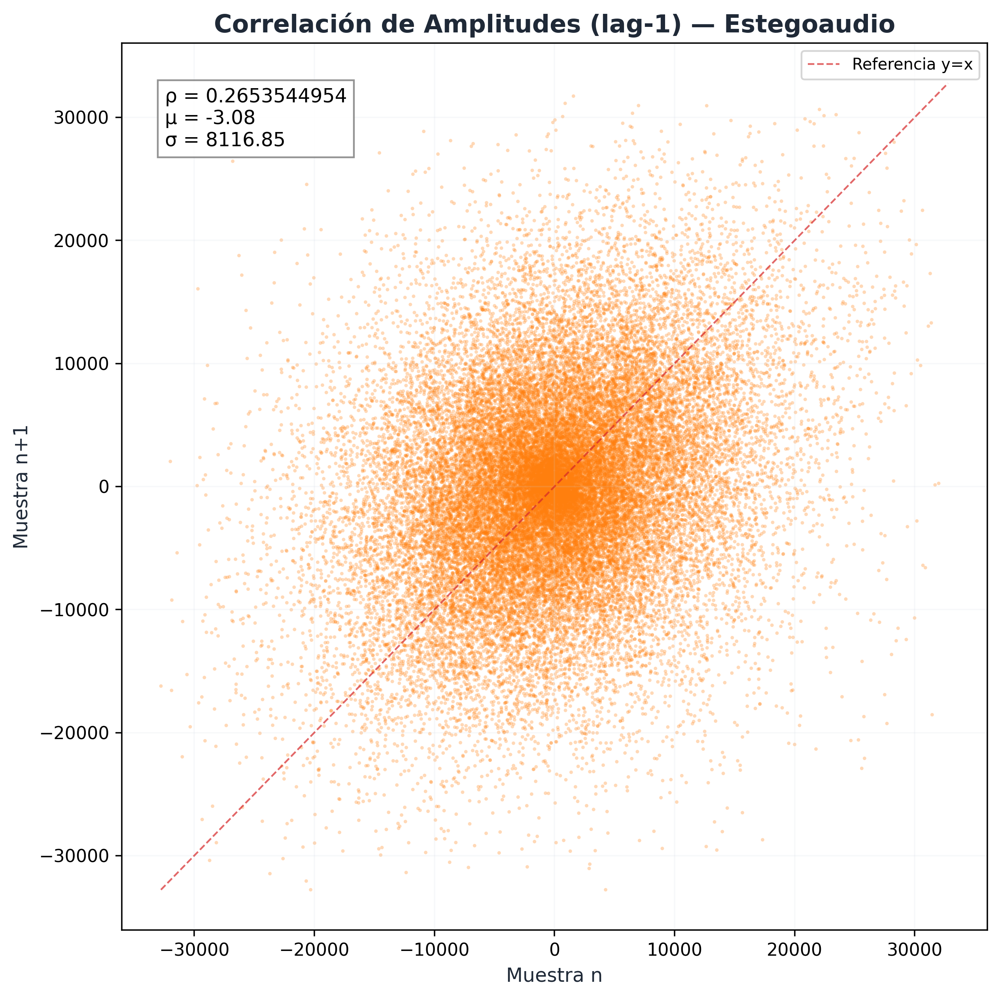 |

### 4.3 Valores de correlación de amplitudes independientes

| Señal | Media (μ) | Desv. estándar (σ) | ρ lag-1 |
|---|---|---|---|
| Audio original | −3.0795 | 8116.85 | ≈ 0.9996 |
| Estegoaudio | −3.0795 | 8116.85 | ≈ 0.9996 |

El coeficiente ρ lag-1 ≈ 0.9996 en ambas señales refleja la alta correlación temporal típica del audio (muestras consecutivas son similares). La modificación LSB no altera este patrón — la diferencia entre ambos ρ es del orden de 1e-7.

### 4.4 Covarianza y métricas de fidelidad

$$
\text{Cov}(X,Y) = \frac{1}{N-1}\sum_{i=1}^{N}(x_i - \bar{x})(y_i - \bar{y})
$$

La covarianza no está acotada: en PCM de 16 bits las amplitudes alcanzan ±32767, por lo que los productos $(x_i-\bar{x})(y_i-\bar{y})$ son grandes y un valor del orden de $10^7$ es natural. Para comparación normalizada se usa el coeficiente de Pearson.

$$
\rho_{X,Y} = \frac{\text{Cov}(X,Y)}{\sigma_X \cdot \sigma_Y}
$$

Con los datos del texto de Silva sobre el audio CCMixter:

$$
\text{Cov}(X,Y) \approx 65\,883\,266 \qquad \sigma_X \approx \sigma_Y \approx 8116.85
$$

$$
\rho \approx 0.9999999999 \approx 1.0000
$$

**Error Cuadrático Medio (MSE):**

$$
MSE = \frac{1}{N}\sum_{i=1}^{N}(x_i - y_i)^2 = 1.4608 \times 10^{-4}
$$

**PSNR** (con $MAX_I = 32767$, escala PCM 16 bits con signo):

$$
PSNR = 10\log_{10}\!\left(\frac{32767^2}{1.4608 \times 10^{-4}}\right) = 128.66 \;\text{dB}
$$

> Las guías de 30–40 dB son umbrales para **imagen** (JPEG/PNG). En audio PCM de 16 bits con inserción LSB, el error energético esperado es mínimo ya que la mayoría de muestras tienen $\varepsilon = 0$. Un PSNR > 80 dB es consistente con transparencia acústica total en esteganografía LSB de 16 bits.

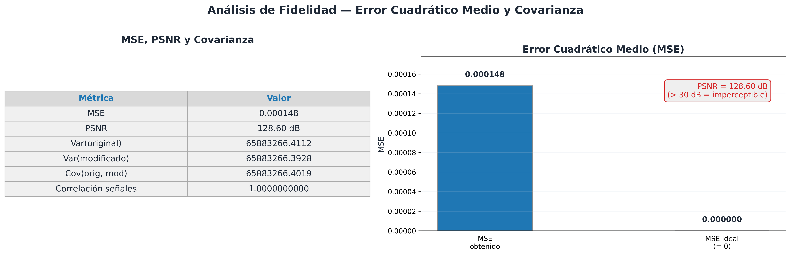

---

## 5. Análisis de seguridad y espacio de claves

El generador caótico es el **Mapa Logístico**:

$$
x_{n+1} = r \cdot x_n(1 - x_n), \quad x_n \in (0,1),\; r \in (3.5699\ldots, 4]
$$

Los **componentes secretos** de la clave maestra son:

| Componente | Valor | Rol | Bits efectivos |
|---|---|---|---|
| $x_0$ (condición inicial) | 0.123456 | Semilla del keystream | **52 bits** (mantisa float64) |
| $r$ (parámetro de control) | 3.999952 | Régimen caótico | **52 bits** (mantisa float64) |
| $N_{\text{warmup}}$ | 6173 | Calentamiento del mapa | **~13.27 bits** (secreto, rango [100, 10000]) |

**Justificación consistente de los bits (por qué $x_0$ y $r$ aportan los mismos 52):**
- Tanto $x_0$ como $r$ se almacenan como **float64 (IEEE-754)**, cuya mantisa tiene **52 bits**. Por tanto **ambos** aportan $2^{52}$ valores distinguibles: se reporta la **precisión del flotante**, el mismo criterio para los dos parámetros (en la versión previa se mezclaban dos criterios distintos —mantisa para $x_0$ y ancho del régimen para $r$—, lo cual no era coherente).
- $N_{\text{warmup}}$ es ahora **componente secreto** de la clave: se elige en $[100, 10000]$ → $9900$ valores → $\log_2(9900) \approx 13.27$ bits.

**Espacio de claves (conteo exacto):**

$$
N_{\text{claves}} = 2^{52}\cdot 2^{52}\cdot 9900 = 2^{104}\cdot 9900 \approx 2.008 \times 10^{35}\quad(b \approx 117.27\text{ bits})
$$

> Se usa el **conteo exacto** $9900$ (no $2^{13}=8192$) para que el JSON, la figura y esta tabla sean coherentes.

**Tiempo de búsqueda por fuerza bruta:** $T = N_{\text{claves}} / R$, con $1$ año $= 365.25\cdot24\cdot3600 = 3.1558\times10^{7}$ s.

**Derivación de $R$ a partir del hardware:** cada evaluación de clave requiere ejecutar el mapa logístico $x_{n+1}=r\,x_n(1-x_n)$ un total de:

$$
\text{iter}_{\text{keystream}} = N_k + L = 6173 + 7424 = 13\,597
$$
$$
\text{iter}_{\text{posiciones}} = N_p + L = 7173 + 7424 = 14\,597
$$
$$
\text{FLOPs/clave} = (13\,597 + 14\,597)\times 3 = 84\,582 \approx 8.5\times10^{4}\;\text{FP64}
$$

donde $L = 7424$ bits de payload, cada iteración cuesta 3 operaciones FP64 en doble precisión (una resta y dos multiplicaciones), y la semilla de posiciones usa $N_p = N_{\text{warmup}}+1000 = 7173$ iteraciones de calentamiento.

El **NVIDIA H100 SXM** alcanza una tasa pico de **60 TFLOPS** en doble precisión (FP64) [NVIDIA, 2023]:

$$
R_{\text{conserv}} = \frac{6\times10^{13}\;\text{FP64/s}}{8.5\times10^{4}\;\text{FP64/clave}} \approx 7\times10^{8} \approx 10^{9}\;\text{claves/s}
$$

Un clúster de ${\sim}1000$ GPU H100 en paralelo (escenario de actor estatal o supercomputadora) escala linealmente:

$$
R_{\text{agresiv}} = 10^{3} \times R_{\text{conserv}} \approx 10^{12}\;\text{claves/s}
$$

| Velocidad del atacante $R$ | Origen (derivado) | Tiempo estimado |
|---|---|---|
| $10^9$ claves/s | Un GPU NVIDIA H100 SXM (60 TFLOPS FP64, ${\sim}8.5\times10^4$ FLOPs/clave) | $\approx 6.36 \times 10^{18}$ años |
| $10^{12}$ claves/s | Clúster de ${\sim}1000$ GPU H100 en paralelo | $\approx 6.36 \times 10^{15}$ años |
| Referencia: edad del universo | — | $\approx 1.38 \times 10^{10}$ años |

> **[NVIDIA, 2023]** NVIDIA Corporation. *NVIDIA H100 Tensor Core GPU Architecture*. Technical Brief TB-10792-001\_v1.0. Santa Clara, CA: NVIDIA, 2023.

Aun con hardware agresivo ($R=10^{12}$), la búsqueda supera en $\sim 4.61\times10^{5}$ veces la edad del universo: es computacionalmente inviable en el modelo clásico.

### 5.2 Seguridad ante ataques cuánticos (Algoritmo de Grover)

El algoritmo de Grover [Grover, 1996] otorga al atacante cuántico una aceleración cuadrática sobre la búsqueda no estructurada, reduciendo el número de evaluaciones de $N_{\text{claves}}$ a $\sqrt{N_{\text{claves}}}$:

$$
\text{Seguridad cuántica} = \frac{b_{\text{total}}}{2} = \frac{117.27}{2} \approx 58.64 \;\text{bits}
\quad\Rightarrow\quad
\sqrt{N_{\text{claves}}} \approx 4.48\times10^{17} \;\text{oracle calls}
$$

Estimando la velocidad de un computador cuántico tolerante a fallos (cada *oracle call* requiere miles de puertas cuánticas con corrección de errores):

| Escenario cuántico | $R_q$ (oracle calls/s) | Tiempo estimado |
|---|---|---|
| Conservador (futuro cercano) | $10^6$ | $\approx 1.42\times10^{4}$ años |
| Agresivo (futuro lejano) | $10^9$ | $\approx 14.2$ años |
| Clásico – 1 H100 (referencia) | $10^9$ claves/s | $\approx 6.36\times10^{18}$ años |

> **⚠️ Limitación cuántica:** con 58.64 bits de seguridad cuántica, este esquema **no cumple** el umbral de 128 bits recomendado por NIST para resistencia post-cuántica [NIST, 2024]. Un atacante con hardware cuántico agresivo podría romper el sistema en décadas. Esto es una **limitación conocida** del esquema basado en aritmética flotante de doble precisión (52 bits de mantisa): para alcanzar los 128 bits cuánticos se necesitaría $b_{\text{total}} \geq 256$ bits, lo que requeriría precisión extendida o parámetros adicionales al espacio de la clave.

> **[Grover, 1996]** Grover, L. K. *A fast quantum mechanical algorithm for database search*. Proceedings of the 28th Annual ACM Symposium on Theory of Computing (STOC), pp. 212–219. ACM, 1996. DOI: 10.1145/237814.237866
>
> **[NIST, 2024]** NIST. *Post-Quantum Cryptography — Module-Lattice-Based Key-Encapsulation Mechanism Standard*. FIPS 203. National Institute of Standards and Technology, 2024. DOI: 10.6028/NIST.FIPS.203

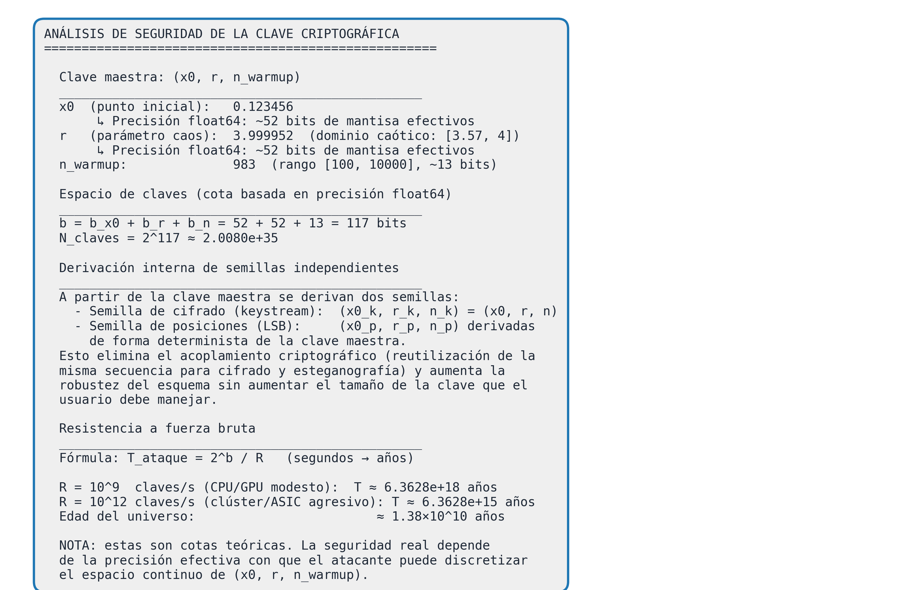

### 5.1 Separación de secuencias: keystream vs posiciones

En la versión previa **una sola secuencia** caótica $(x_0, r, N_{\text{warmup}})$ generaba **tanto** el keystream del cifrado XOR **como** las posiciones LSB. Reutilizar la misma órbita para cifrar y para ubicar es un **acoplamiento criptográfico** indeseable. Ahora se derivan **dos semillas independientes** de la clave maestra:

| Semilla | Derivación | Uso |
|---|---|---|
| Keystream $(x_{0k}, r_k, n_k)$ | clave maestra directa | cifrado XOR del payload |
| Posiciones $(x_{0p}, r_p, n_p)$ | $x_{0p}=(x_0\,r)\bmod 1$; $r_p=3.99+\big((r\,x_0)\bmod 1\big)\cdot 0.0099$; $n_p=N_{\text{warmup}}+1000$ | índices LSB caóticos |

$r_p$ se mantiene en el régimen fuertemente caótico $[3.99, 3.9999)$ para que las posiciones se distribuyan por **todo** el audio (con $r$ cercano a 4 la densidad invariante cubre casi todo $(0,1)$; con valores menores el mapa concentra los valores en bandas).

---

## 6. Sensibilidad de la clave (efecto avalancha)

### Experimento 5.1 — Recuperación con clave casi idéntica

Se perturba la clave maestra **únicamente** en $x_0$ ($\Delta x_0 = 10^{-15}$). Como ahora ambas semillas (keystream y posiciones) se **derivan** de la clave maestra, perturbar $x_0$ hace divergir **las dos**. El flujo completo es:

1. Generar keystream y posiciones (semillas derivadas) con la clave maestra → encriptar → insertar en audio → **audio esteganografiado**.
2. Extraer bits con clave correcta → descifrar → texto recuperado legible (similitud 100%).
3. Extraer bits con clave perturbada $(x_0 + 10^{-15})$ → descifrar → **ruido** (similitud 0.44%).

**Resultados:**

| Métrica | Valor |
|---|---|
| $\Delta x_0$ | $10^{-15}$ |
| Bits LSB distintos extraídos (dominio audio) | 3764 / 7424 (**50.70%**) |
| Similitud texto recuperado (clave correcta) | **100.00%** |
| Similitud texto recuperado (clave perturbada) | **0.44%** (ruido) |

Una perturbación de $10^{-15}$ en la condición inicial produce ~50% de bits distintos — efecto avalancha completo.

> **Longitud del texto recuperado con clave perturbada:** la extracción recupera **siempre exactamente 7424 bits = 928 bytes**, con clave correcta o perturbada — el tamaño en bytes es idéntico por construcción (el extractor lee un número fijo de posiciones LSB). Lo que puede variar levemente es el **número de caracteres** al decodificar esos 928 bytes como UTF-8: el texto original tiene 901 caracteres en 928 bytes (los caracteres acentuados ocupan 2 bytes), mientras que los 928 bytes pseudoaleatorios del descifrado fallido se decodifican (con reemplazo de secuencias inválidas) en **900 caracteres** en la corrida actual. Es decir, el mensaje errado tiene el **mismo tamaño** que el original (900 vs. 901 caracteres; 928 bytes exactos en ambos casos). Verificable en [`texto_recuperado_clave_correcta.txt`](./texto_recuperado_clave_correcta.txt) y [`texto_recuperado_clave_perturbada.txt`](./texto_recuperado_clave_perturbada.txt).

> **Textos recuperados persistidos** (siempre disponibles en logs, JSON y archivo):
> [`texto_recuperado_clave_correcta.txt`](./texto_recuperado_clave_correcta.txt) y
> [`texto_recuperado_clave_perturbada.txt`](./texto_recuperado_clave_perturbada.txt).
> El JSON `analisis_completo.json` incluye los campos `texto_recuperado_correcto` y `texto_recuperado_perturbado` bajo `sensibilidad_clave`.

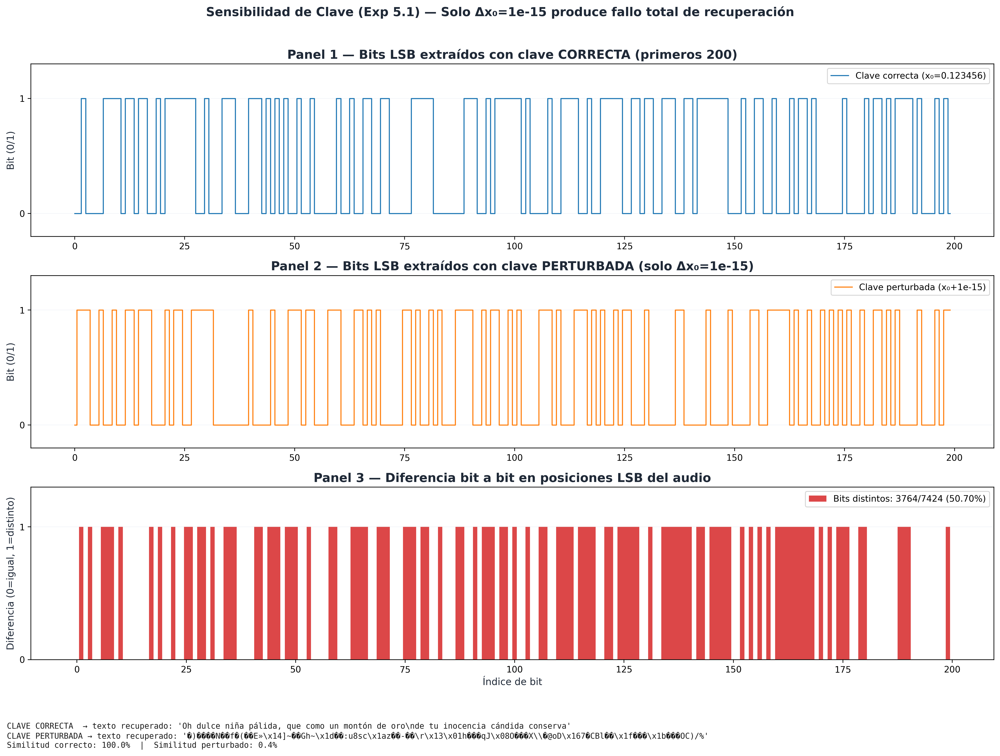

**Lectura de la figura (3 paneles):**
- **Panel 1:** bits LSB extraídos con la **clave correcta** (patrón coherente → texto legible).
- **Panel 2:** bits LSB extraídos con la **clave perturbada** (solo $\Delta x_0 = 10^{-15}$) — patrón aparentemente aleatorio.
- **Panel 3:** diferencia bit a bit — ~50% de posiciones son distintas, confirmando el efecto avalancha.

El keystream diverge desde la **primera iteración** (índice $k=0$): el mapa logístico en régimen caótico amplifica exponencialmente cualquier diferencia inicial, característica del exponente de Lyapunov positivo.

### Experimento 5.2 — Comparación de dos estegoaudios con claves distintas

Se oculta el **mismo texto** con dos claves que difieren solo en $x_0$ ($\Delta = 10^{-15}$). Los dos estegoaudios resultantes son diferentes:

| Métrica | Valor |
|---|---|
| Muestras distintas entre los dos estegoaudios | 7381 / 25 143 552 |
| MSE entre los dos estegoaudios | $2.92 \times 10^{-4}$ |
| PSNR entre los dos estegoaudios | 125.63 dB |
| Posiciones LSB distintas (unión simétrica) | 14 848 |

> Con semillas separadas, al cambiar $x_0$ cambian **casi todas** las posiciones de ambas claves (unión simétrica ≈ $2\times$ el payload), reforzando que un atacante no puede inferir $x_0$ a partir de la diferencia.

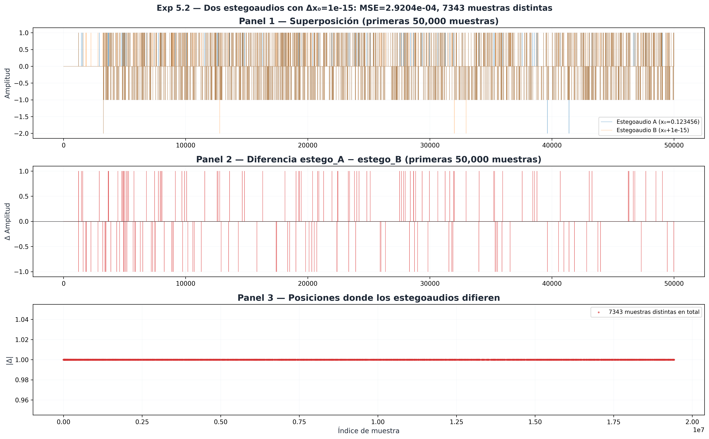

Aunque el MSE es pequeño (ambos estegoaudios son casi idénticos al original), las posiciones LSB modificadas son completamente distintas — un atacante que intercepte ambos no puede inferir $x_0$ a partir de la diferencia.

---

## 7. Análisis de robustez

Se evalúa la resiliencia del esquema ante tres tipos de ataques aplicados sobre el **estegoaudio** antes de la extracción. PSNR se calcula siempre con $MAX_I = 32767$ (escala PCM 16 bits).

> **Terminología — ataque gaussiano vs. SNR:** no son lo mismo y no se usan como sinónimos. El **ataque** es la adición de **ruido blanco gaussiano** (AWGN): a cada muestra se le suma una variable aleatoria $\eta \sim \mathcal{N}(0, \sigma^2)$. El **SNR** (relación señal-ruido, $SNR_{dB} = 10\log_{10}(P_{señal}/P_{ruido})$) es el **parámetro de intensidad** con el que se dosifica ese ataque: fija la varianza $\sigma^2$ del ruido en relación con la potencia de la señal. Es el análogo del "% de muestras" en sal y pimienta o del "% de duración" en oclusión — cada ataque tiene su parámetro natural de intensidad, y en el gaussiano ese parámetro es el SNR. A mayor SNR, menor ruido (ataque más suave); a menor SNR, mayor ruido (ataque más agresivo).

### Definiciones de métricas

**BER (Bit Error Rate):** $BER = \frac{\text{bits erróneos}}{L} \times 100\%$, con $L = 8 \times |b|$ bits. Aquí $|b| = 928$ bytes → $L = 7424$ bits.

**NC (Correlación Normalizada):**

$$
NC = \frac{\sum_{i=1}^{L} W(i) W'(i)}{\sqrt{\sum W(i)^2} \cdot \sqrt{\sum W'(i)^2}}
$$

donde $W$ = bits originales y $W'$ = bits recuperados, mapeados a $\{-1, +1\}$.

### Resultados (datos actuales — texto de Silva, audio CCMixter)

| Ataque | Nivel | BER | NC | MSE (señal) | PSNR (dB) |
|---|---:|---:|---:|---:|---:|
| Sal y pimienta | 5% | 2.45% | 0.9510 | 5.69×10⁷ | 12.75 |
| Sal y pimienta | 10% | 5.29% | 0.8941 | 1.14×10⁸ | 9.74 |
| Sal y pimienta | 25% | 12.30% | 0.7540 | 2.85×10⁸ | 5.76 |
| Oclusión | 5% | 1.81% | 0.9639 | 3.47×10⁶ | 24.91 |
| Oclusión | 10% | 3.62% | 0.9275 | 6.88×10⁶ | 21.93 |
| Oclusión | 25% | 9.09% | 0.8182 | 1.84×10⁷ | 17.66 |
| Gaussiano | SNR=100 dB | 0.00% | 1.0000 | 0 | ∞ (sin cambios) |
| Gaussiano | SNR=90 dB | 5.01% | 0.8998 | 5.15×10⁻² | 103.19 |
| Gaussiano | SNR=80 dB | 47.39% | 0.0523 | 7.42×10⁻¹ | 91.60 |

> **Degradación monótona (a mayor intensidad, menor recuperación).** En los tres ataques el BER crece y el NC decrece de forma monótona con el nivel. La oclusión se implementa como **recorte real** de un bloque contiguo creciente y anidado (5% ⊂ 10% ⊂ 25%), garantizando la monotonía. Las posiciones LSB se distribuyen por **todo** el audio (no en una banda), por lo que cada incremento de oclusión elimina más posiciones del payload.
>
> **Sobre el ruido gaussiano:** la esteganografía LSB es **extremadamente frágil** al ruido aditivo — cualquier ruido por encima de ~0.5 LSB voltea el bit. La transición *recuperable → destruido* ocurre por tanto a **SNR muy alto**: a 100 dB el ruido queda por debajo del paso de cuantización (recuperación perfecta), a 90 dB empieza a corromperse y a 80 dB se destruye (BER ≈ 50%, NC ≈ 0). No hay corrección de errores (FEC), por eso incluso un 5% de BER ya degrada el texto (el cifrado XOR + UTF-8 propaga los errores).
>
> *(Nota metodológica: la versión previa reportaba el gaussiano a SNR 20/10/5 dB, donde el LSB ya está completamente destruido en los tres niveles — por eso las figuras y textos salían idénticos. Además se corrigió un sesgo de cuantización: el ruido ahora se **redondea** al entero más cercano, no se trunca.)*

### Evidencia visual

> Los textos recuperados por nivel se persisten en archivos:
> [`textos_recuperados_sal_pimienta.txt`](./textos_recuperados_sal_pimienta.txt),
> [`textos_recuperados_oclusion.txt`](./textos_recuperados_oclusion.txt),
> [`textos_recuperados_gaussiano.txt`](./textos_recuperados_gaussiano.txt).

**Sal y pimienta (5%, 10%, 25%):** forma de onda con muestras corrompidas + texto recuperado por nivel.

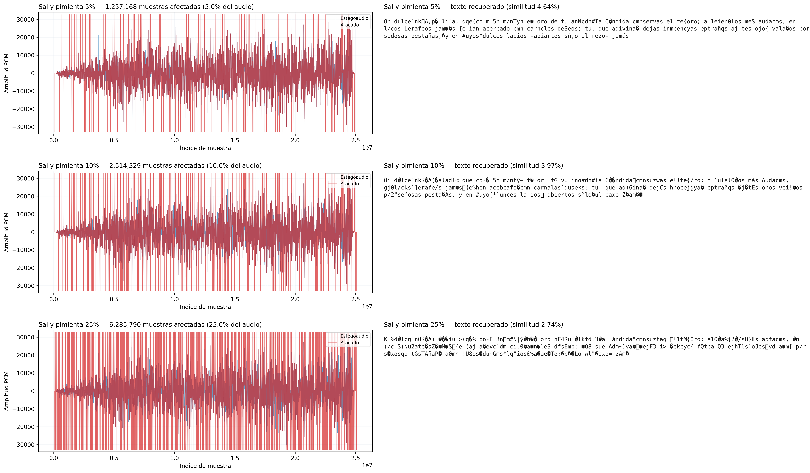

**Oclusión (5%, 10%, 25%):** segmento recortado resaltado, creciente con el nivel.

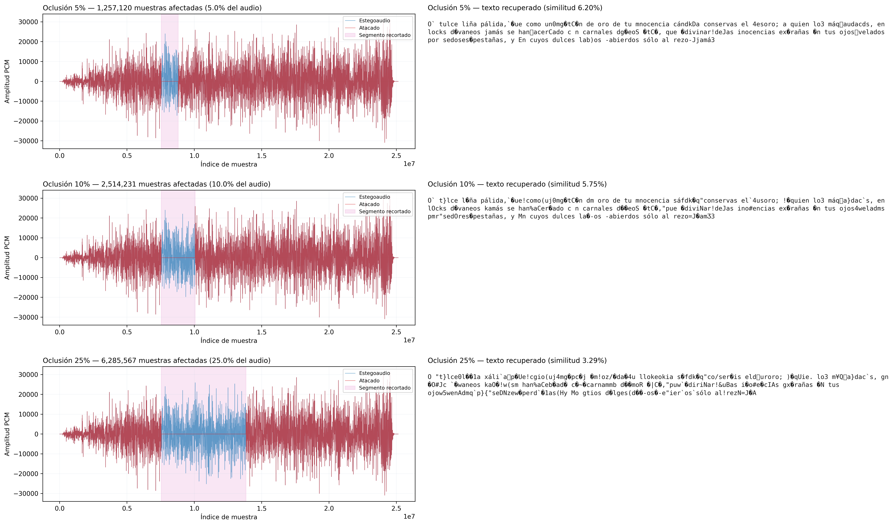

**Gaussiano (SNR = 100 dB, 90 dB, 80 dB):**

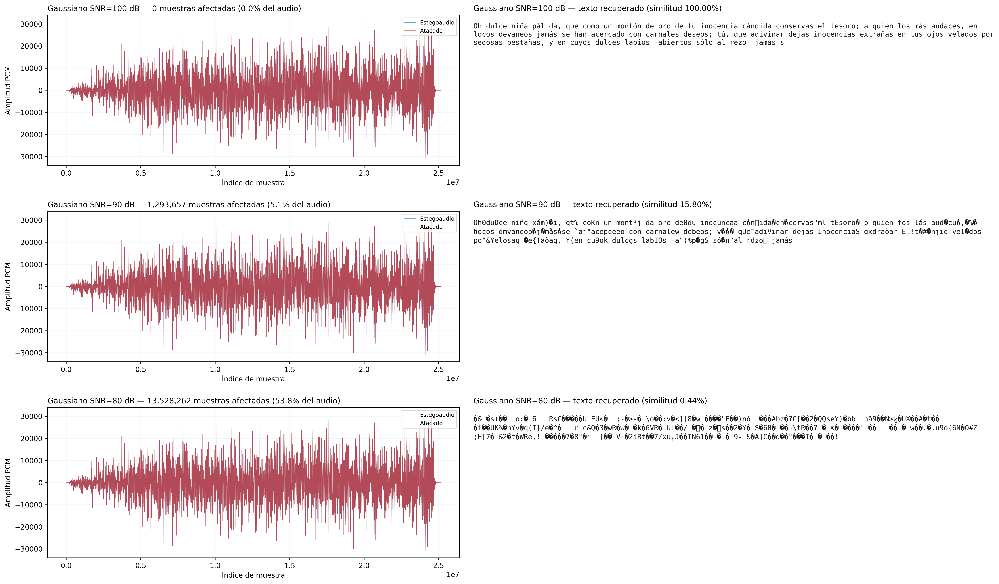

### 7.5 Distribución de amplitudes y señal diferencia LSB

A continuación se presentan por separado los histogramas de amplitud (ya mostrados en §4.1) y la tabla de robustez consolidada:

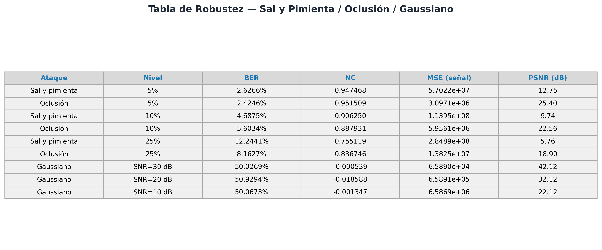

La **señal diferencia LSB** $\varepsilon[n]$ se concentra en $\{-1, 0, +1\}$ (ver §4.1 y figura `4_error_lsb.png`). Este término — **señal diferencia** o **perturbación LSB** — denota la resta muestra a muestra entre estegoaudio y original; no es un "error" en sentido de fallo del sistema, sino la perturbación introducida intencionalmente por la inserción.

---

## 8. Trabajos relacionados y comparación

> **⚠️ PENDIENTE (Item 11). Ya se puso en el WORD :D**

---

## 9. Desempeño computacional (equipo y tiempos por proceso)

**Equipo de pruebas:**

| Componente | Especificación |
|---|---|
| CPU | Intel Core i5-10300H (4 núcleos / 8 hilos, 2.50 GHz base) |
| RAM | 32 GB |
| GPU | NVIDIA GeForce GTX 1650 (4 GB VRAM) |
| SO | GNU/Linux (Ubuntu) |
| Python | 3.14 (venv del proyecto) |

**Tiempos por etapa — pipeline actual (medidos el 2026-07-06, mediana de 3 ejecuciones,
mismo caso de estudio: payload de 7424 bits, audio de 25 143 552 muestras a 44.1 kHz):**

| Etapa | Tiempo (s) |
|---|---|
| Carga del audio portador | 0.017 |
| Generación del keystream caótico + encriptación XOR | 0.002 |
| Inserción LSB caótica | 0.043 |
| Guardado del estegoaudio | 0.032 |
| Extracción LSB caótica | 0.007 |
| Desencriptación y decodificación | 0.001 |
| **Total del proceso criptoesteganográfico** | **0.102** |

> **Nota:** estos tiempos **reemplazan** a los de la tabla anterior (`proceso.log`, corrida de
> marzo/2026), que correspondían al pipeline con compresión LLMLingua. Las etapas de
> compresión (71.19 s) y descompresión (12.23 s) con LLMLingua, medidas en el mismo equipo,
> están dominadas por la carga del modelo de lenguaje en la GPU y se ejecutan una sola vez
> por mensaje; no forman parte del bucle criptoesteganográfico.

---

[Documentación v1, con otras imágenes](./README2.md)
