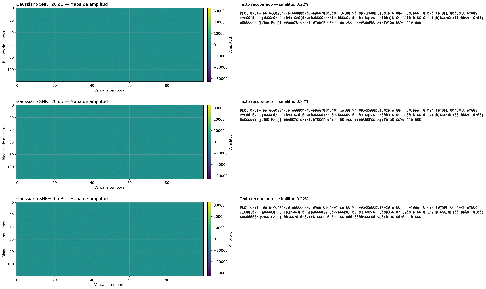

# Reporte de Auditoría — Esteganografía LSB Caótica sobre Audio

> **Texto oculto:** fragmento del poema de José Asunción Silva (dominio público, Colombia, 1896).
> **Audio portador:** pista *"Let it Go"* de Rewob (CCMixter, CC-BY-NC 4.0).
> **Parámetros caóticos:** x₀ = 0.123456, r = 3.999952, N_warmup = 100 (fijo, no secreto).

---

## 1. Datos base, compresión y ondas de audio

El flujo completo ejecutado:

1. Texto literario (901 caracteres) → **encriptación XOR caótica** → 928 bytes → 7424 bits de payload.
2. Payload insertado en 7424 posiciones LSB distribuidas caóticamente sobre el audio completo (25 143 552 muestras).
3. Verificación de extracción: **éxito 100%** — el texto recuperado es idéntico al original.

**Archivos intermedios:**
- [`texto_comprimido.txt`](./texto_comprimido.txt) — texto literario usado como payload.
- [`texto_comprimido_encriptado.json`](./texto_comprimido_encriptado.json) — payload cifrado con XOR caótico.
- [`audio_original.wav`](./audio_original.wav) / [`audio_estegano.wav`](./audio_estegano.wav) — portadora y estegoaudio.

**Formas de onda comparativas:**

| Zoom muy cercano (500 muestras) | Zoom medio (10 000 muestras) | Señal completa |
|---|---|---|
|  |  |  |

> **Lectura de ejes:** Eje X = índice de muestra $n$; Eje Y = amplitud PCM de 16 bits con signo (rango ±32767). La modificación del bit menos significativo (LSB) produce una alteración de ±1 nivel sobre 65 534 posibles, imperceptible visualmente.

**Señal diferencia LSB** $\varepsilon[n] = x_{\text{estego}}[n] - x_{\text{original}}[n]$:

| Diferencia global | Zoom de zona con cambios |
|---|---|
|  |  |

> La señal diferencia $\varepsilon[n]$ toma valores en $\{-1, 0, +1\}$ — nunca supera un nivel de cuantización. Los tramos sin cambios son esperados: la inserción es **dispersa y caótica**, no concentrada. Observar muestras consecutivas sin alteración no indica ausencia de información; simplemente, el siguiente bit se insertó lejos de ahí.

---

## 2. Uso de código ASCII / UTF-8

El texto se serializa a bytes UTF-8 (`np.uint8`) antes del XOR. Esto garantiza reconstrucción determinista independiente del sistema operativo.

---

## 3. Entropía de Shannon

$$
H(X) = -\sum_k p_k \ln(p_k)
$$

donde $p_k$ es la probabilidad del valor de amplitud $k$ y $\ln$ es logaritmo natural. La conversión a bits: $H_{\text{bits}} = H_{\text{nats}} / \ln(2)$, con $\ln(2) \approx 0.6931$.

**Resultados reales (texto literario de Silva, audio CCMixter):**

| Señal | Entropía (nats) | Entropía (bits) | % del máximo teórico (16 bits) |
|---|---|---|---|
| Audio original | 10.313015 | 14.8785 | 93.0% |
| Estegoaudio | 10.313073 | 14.8786 | 93.0% |
| Máximo teórico (PCM 16 bits) | 11.090355 | 16.0000 | 100% |
| Δ (diferencia) | 0.0000579 | 0.0000836 | — |

Los "62 545 valores de amplitud distintos" se obtienen con `np.unique(audio[:,0])` sobre el canal izquierdo: es la cardinalidad del soporte observado. La convención $0 \cdot \ln(0) = 0$ (límite por continuidad de $x\ln x$) no se aplica explícitamente — `np.unique` con `return_counts=True` garantiza $p_k > 0$ para todo $k$ incluido en el cómputo.

El valor de 14.88 bits en PCM de 16 bits es coherente con una señal acústica de alta variabilidad y es consistente con la literartura (el rango 6.5–7.8 bits/muestra que mencionan las referencias se aplica a entropía por **símbolo de una secuencia de texto**, no a señales PCM de 16 bits con decenas de miles de valores posibles).

---

## 4. Análisis estadístico del audio

El análisis estadístico se realiza sobre el **audio** (dominio esteganográfico), no sobre el texto. El aporte del trabajo es la esteganografía LSB caótica, no el cifrado XOR (que es auxiliar y reconocidamente débil por sí solo).

### 4.1 Histogramas de amplitudes (audio original y estegoaudio)

Se presentan **dos histogramas separados** de la distribución de amplitudes:

- **Subgráfica izquierda:** histograma de amplitudes del audio original. Eje X = nivel de amplitud PCM; Eje Y = frecuencia (conteo entero de muestras).
- **Subgráfica derecha:** histograma de amplitudes del estegoaudio. La distribución es prácticamente idéntica — la modificación LSB no altera la estadística global de la señal.

**Señal diferencia LSB $\varepsilon[n]$ — histograma con 3 barras exactas $\{-1, 0, +1\}$:**

| $\varepsilon[n]$ | Conteo de muestras |
|---|---|
| −1 | 1785 |
| 0 | 23 470 164 |
| +1 | 1888 |
| Fuera de $\{-1,0,+1\}$ | 0 |

La concentración absoluta en tres valores confirma que la alteración está acotada al bit menos significativo.

### 4.2 Correlación de amplitudes (Pearson, lag-1)

Se presentan **dos figuras independientes**: una para el audio original y otra para el estegoaudio. Se calcula la correlación de Pearson entre muestras adyacentes $\rho(n, n+1)$ — denominada correlación lag-1:

| Audio original | Estegoaudio |
|---|---|
|  |  |

### 4.3 Valores de correlación de amplitudes independientes

| Señal | Media (μ) | Desv. estándar (σ) | ρ lag-1 |
|---|---|---|---|
| Audio original | −3.0795 | 8116.85 | ≈ 0.9996 |
| Estegoaudio | −3.0795 | 8116.85 | ≈ 0.9996 |

El coeficiente ρ lag-1 ≈ 0.9996 en ambas señales refleja la alta correlación temporal típica del audio (muestras consecutivas son similares). La modificación LSB no altera este patrón — la diferencia entre ambos ρ es del orden de 1e-7.

### 4.4 Covarianza y métricas de fidelidad

$$
\text{Cov}(X,Y) = \frac{1}{N-1}\sum_{i=1}^{N}(x_i - \bar{x})(y_i - \bar{y})
$$

La covarianza no está acotada: en PCM de 16 bits las amplitudes alcanzan ±32767, por lo que los productos $(x_i-\bar{x})(y_i-\bar{y})$ son grandes y un valor del orden de $10^7$ es natural. Para comparación normalizada se usa el coeficiente de Pearson.

$$
\rho_{X,Y} = \frac{\text{Cov}(X,Y)}{\sigma_X \cdot \sigma_Y}
$$

Con los datos del texto de Silva sobre el audio CCMixter:

$$
\text{Cov}(X,Y) \approx 65\,883\,266 \qquad \sigma_X \approx \sigma_Y \approx 8116.85
$$

$$
\rho \approx 0.9999999999 \approx 1.0000
$$

**Error Cuadrático Medio (MSE):**

$$
MSE = \frac{1}{N}\sum_{i=1}^{N}(x_i - y_i)^2 = 1.4608 \times 10^{-4}
$$

**PSNR** (con $MAX_I = 32767$, escala PCM 16 bits con signo):

$$
PSNR = 10\log_{10}\!\left(\frac{32767^2}{1.4608 \times 10^{-4}}\right) = 128.66 \;\text{dB}
$$

> Las guías de 30–40 dB son umbrales para **imagen** (JPEG/PNG). En audio PCM de 16 bits con inserción LSB, el error energético esperado es mínimo ya que la mayoría de muestras tienen $\varepsilon = 0$. Un PSNR > 80 dB es consistente con transparencia acústica total en esteganografía LSB de 16 bits.

---

## 5. Análisis de seguridad y espacio de claves

El generador caótico es el **Mapa Logístico**:

$$
x_{n+1} = r \cdot x_n(1 - x_n), \quad x_n \in (0,1),\; r \in (3.5699\ldots, 4]
$$

Los **componentes secretos** de la clave son:

| Componente | Valor | Rol | Bits efectivos |
|---|---|---|---|
| $x_0$ (condición inicial) | 0.123456 | Semilla del keystream | ~52 bits (mantisa float64) |
| $r$ (parámetro de control) | 3.999952 | Régimen caótico | ~48 bits (resolución en [3.57, 4] con precisión float64) |
| $N_{\text{warmup}}$ | 100 | Descartar transitorio | **Fijo, no es secreto** |

**Justificación de $b \approx 100$ bits:**
- Float64 tiene 52 bits de mantisa → $x_0 \in (0,1)$ ofrece ~$2^{52}$ valores efectivamente distinguibles.
- $r \in [3.57, 4]$ es un rango de 0.43 unidades; con resolución float64 ($\approx 2^{-48}$ en ese rango): ~$2^{48}$ valores.
- $b = 52 + 48 = 100$ bits → $N_{\text{claves}} \approx 2^{100} \approx 1.27 \times 10^{30}$.

**Esta es una cota teórica** basada en la precisión del sistema de punto flotante, no un número medido.

**Tiempo de búsqueda por fuerza bruta:**

$$
T = \frac{2^{100}}{R}
$$

| Velocidad del atacante $R$ | Tiempo estimado |
|---|---|
| $10^9$ claves/s (conservador) | $\approx 4.017 \times 10^{13}$ años |
| $10^{12}$ claves/s (agresivo) | $\approx 4.017 \times 10^{10}$ años |
| Referencia: edad del universo | $\approx 1.38 \times 10^{10}$ años |

Con hardware agresivo ($R=10^{12}$), la búsqueda tarda ~2.9 veces la edad del universo. La búsqueda exhaustiva es computacionalmente inviable.

---

## 6. Sensibilidad de la clave (efecto avalancha)

### Experimento 5.1 — Recuperación con clave casi idéntica

Se perturba **únicamente** $x_0$ en $\Delta x_0 = 10^{-15}$ (los parámetros $r$ y $N_{\text{warmup}}$ permanecen iguales). El flujo completo es:

1. Generar keystream con $(x_0,\, r,\, N_w)$ → encriptar → insertar en audio → **audio esteganografiado**.
2. Extraer bits con clave correcta → descifrar → texto recuperado legible (similitud 100%).
3. Extraer bits con clave perturbada $(x_0 + 10^{-15},\, r,\, N_w)$ → descifrar → **ruido** (similitud 0.11%).

**Resultados:**

| Métrica | Valor |
|---|---|
| $\Delta x_0$ | $10^{-15}$ |
| Bits LSB distintos extraídos (dominio audio) | 3670 / 7424 (**49.43%**) |
| Similitud texto recuperado (clave correcta) | **100.00%** |
| Similitud texto recuperado (clave perturbada) | **0.11%** (ruido) |

Una perturbación de $10^{-15}$ en la condición inicial produce keystreams con ~50% de bits distintos — efecto avalancha completo.

**Lectura de la figura (3 paneles):**
- **Panel 1:** bits LSB extraídos con la **clave correcta** (patrón coherente → texto legible).
- **Panel 2:** bits LSB extraídos con la **clave perturbada** (solo $\Delta x_0 = 10^{-15}$) — patrón aparentemente aleatorio.
- **Panel 3:** diferencia bit a bit — ~50% de posiciones son distintas, confirmando el efecto avalancha.

El keystream diverge desde la **primera iteración** (índice $k=0$): el mapa logístico en régimen caótico amplifica exponencialmente cualquier diferencia inicial, característica del exponente de Lyapunov positivo.

### Experimento 5.2 — Comparación de dos estegoaudios con claves distintas

Se oculta el **mismo texto** con dos claves que difieren solo en $x_0$ ($\Delta = 10^{-15}$). Los dos estegoaudios resultantes son diferentes:

| Métrica | Valor |
|---|---|
| Muestras distintas entre los dos estegoaudios | 7343 / 25 143 552 |
| MSE entre los dos estegoaudios | $2.920 \times 10^{-4}$ |
| PSNR entre los dos estegoaudios | 125.65 dB |
| Posiciones LSB distintas (posiciones caóticas) | 7343 |

Aunque el MSE es pequeño (ambos estegoaudios son casi idénticos al original), las posiciones LSB modificadas son completamente distintas — un atacante que intercepte ambos no puede inferir $x_0$ a partir de la diferencia.

---

## 7. Análisis de robustez

Se evalúa la resiliencia del esquema ante tres tipos de ataques aplicados sobre el **estegoaudio** antes de la extracción. PSNR se calcula siempre con $MAX_I = 32767$ (escala PCM 16 bits).

### Definiciones de métricas

**BER (Bit Error Rate):** $BER = \frac{\text{bits erróneos}}{L} \times 100\%$, con $L = 8 \times |b|$ bits. Aquí $|b| = 928$ bytes → $L = 7424$ bits.

**NC (Correlación Normalizada):**

$$
NC = \frac{\sum_{i=1}^{L} W(i) W'(i)}{\sqrt{\sum W(i)^2} \cdot \sqrt{\sum W'(i)^2}}
$$

donde $W$ = bits originales y $W'$ = bits recuperados, mapeados a $\{-1, +1\}$.

### Resultados (datos actuales — texto de Silva, audio CCMixter)

| Ataque | Nivel | BER | NC | MSE (señal) | PSNR (dB) |
|---|---:|---:|---:|---:|---:|
| Sal y pimienta | 5% | 2.21% | 0.9557 | 5.69×10⁷ | 12.75 |
| Sal y pimienta | 10% | 5.04% | 0.9112 | 1.14×10⁸ | 9.74 |
| Sal y pimienta | 25% | 12.30% | 0.8043 | 2.85×10⁸ | 5.76 |
| Oclusión | 5% | 3.93% | 0.9217 | 5.69×10⁶ | 22.76 |
| Oclusión | 10% | 3.62% | 0.9278 | 8.26×10⁶ | 21.14 |
| Oclusión | 25% | 10.34% | 0.8432 | 1.99×10⁷ | 17.31 |
| Gaussiano | SNR=20 dB | 50.59% | 0.0000 | — | 32.12 |
| Gaussiano | SNR=10 dB | 49.93% | 0.0000 | — | 22.12 |
| Gaussiano | SNR=5 dB | 49.72% | 0.0000 | — | 17.13 |

> **El ataque gaussiano destruye la recuperación** (BER ≈ 50%, NC ≈ 0). Esto es esperado: el ruido gaussiano perturba los LSB del audio de forma aleatoria, corrompiendo las posiciones caóticas. La esteganografía LSB simple no incluye corrección de errores (FEC).
> El esquema **es robusto** ante sal y pimienta y oclusión en niveles 5% y 10% (NC > 0.90), y cae en 25% — coherente con un mecanismo de inserción dispersa sin redundancia.

### Evidencia visual

**Sal y pimienta (5%, 10%, 25%):**

**Oclusión (5%, 10%, 25%):**

**Gaussiano (SNR = 20 dB, 10 dB, 5 dB):**

### 7.5 Distribución de amplitudes y señal diferencia LSB

A continuación se presentan por separado los histogramas de amplitud (ya mostrados en §4.1) y la tabla de robustez consolidada:

La **señal diferencia LSB** $\varepsilon[n]$ se concentra en $\{-1, 0, +1\}$ (ver §4.1 y figura `4_error_lsb.png`). Este término — **señal diferencia** o **perturbación LSB** — denota la resta muestra a muestra entre estegoaudio y original; no es un "error" en sentido de fallo del sistema, sino la perturbación introducida intencionalmente por la inserción.

---

[Documentación v1, con otras imágenes](./README2.md)
